# Experiment Report

**Run directory:** `experiments/2026-06-11/hdf5_run_01`  
**Dataset type:** hdf5  
**Platform:** device=mps num_workers=0 pin_memory=False use_amp=False kaggle=False colab=False

## Run command

```bash
python train_srgan.py \
    --dataset-type hdf5 \
    --hr-size 45 144 \
    --scale-factor 2.0 \
    --epochs 5 \
    --batch-size 32 \
    --output-dir experiments/2026-06-11/hdf5_run_01
```

## Dataset

| Property | Value |
| --- | --- |
| N train | 134000 |
| N val | 66000 |
| HR shape | (45, 144) |
| LR shape (synthetic) | approx (22, 72) |
| Scale factor | 2.0 |

## Training config

| Param | Value |
| --- | --- |
| epochs | 5 |
| batch_size | 32 |
| lr | 0.0002 |
| lambda_l1 | 50.0 |
| lambda_physics | 10.0 |
| gen_channels | 64 |
| gen_blocks | 8 |
| d_lr_ratio | 0.5 |
| n_critic | 1 |

## Best epoch results

| Metric | Value |
| --- | --- |
| Best epoch | 5 |
| val_l1 | 0.25373 |
| val_psnr_norm | 6.44 dB |
| val_response | 1.0914 |

## Physics metrics (full val split)

| Metric | GAN | Bicubic |
| --- | --- | --- |
| Response mean | 1.0917 | 1.0933 |
| Response std  | 0.0850 | 0.0574 |
| Response median | 1.0715 | 1.0780 |
| Rel error mean | 0.0917 | — |
| Rel error |mean| | 0.0942 | — |

## Correlation metrics

| Metric | Value |
| --- | --- |
| Pearson r (pixel) | 0.9052 |
| SSIM mean | 0.9163 ± 0.0321 |
| Radial profile MSE | 82.1835 |
| Azimuthal profile MSE | 427.4576 |
| GAN sparsity | 0.170 |
| HR sparsity | 0.755 |

## Figures

### Training
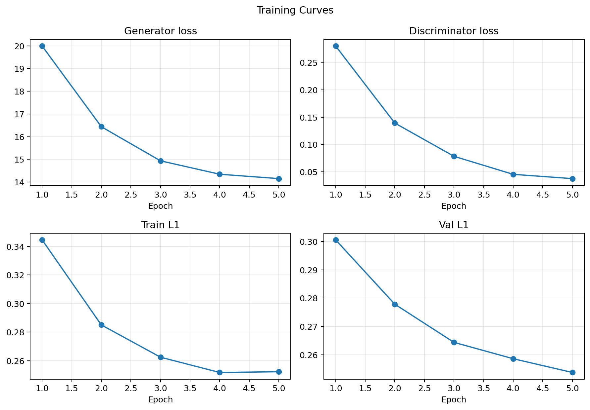
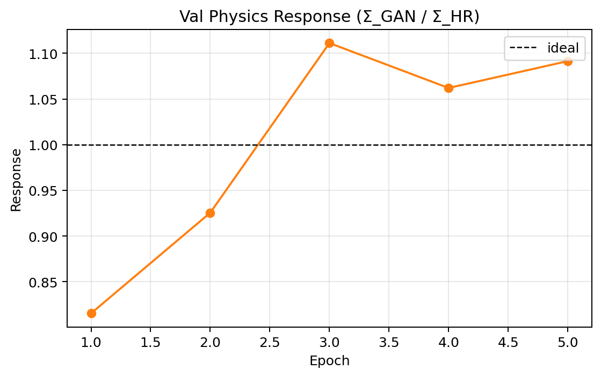
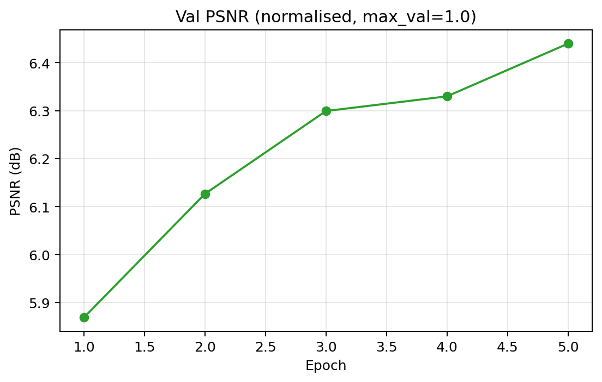

### Reconstruction
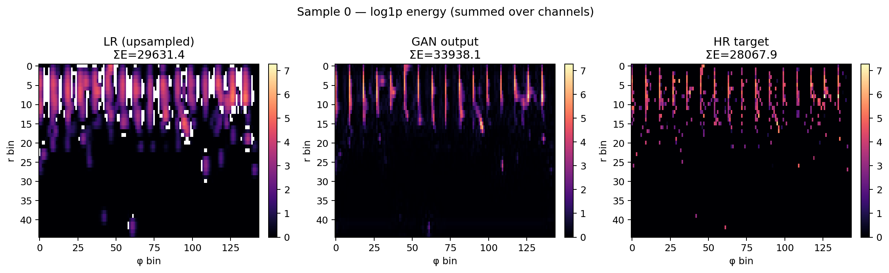
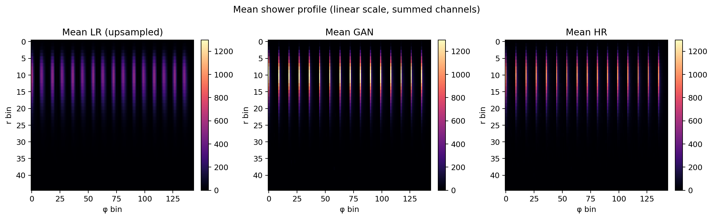
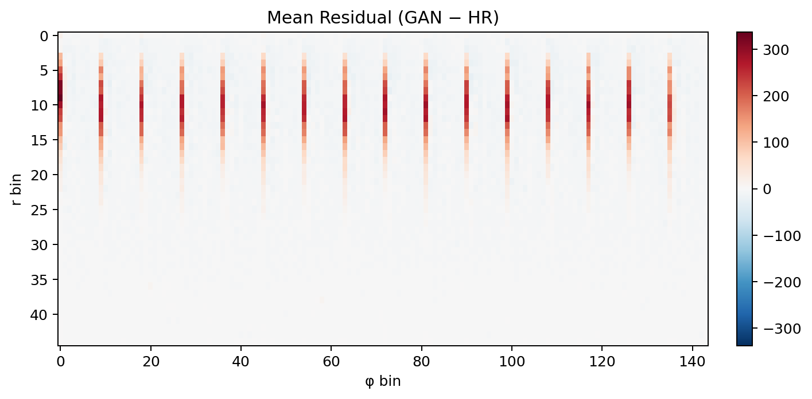

### Physics
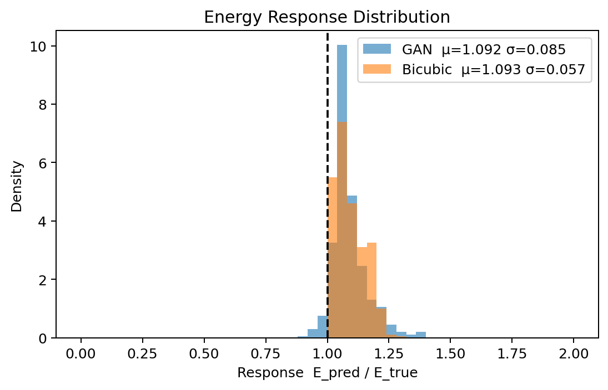
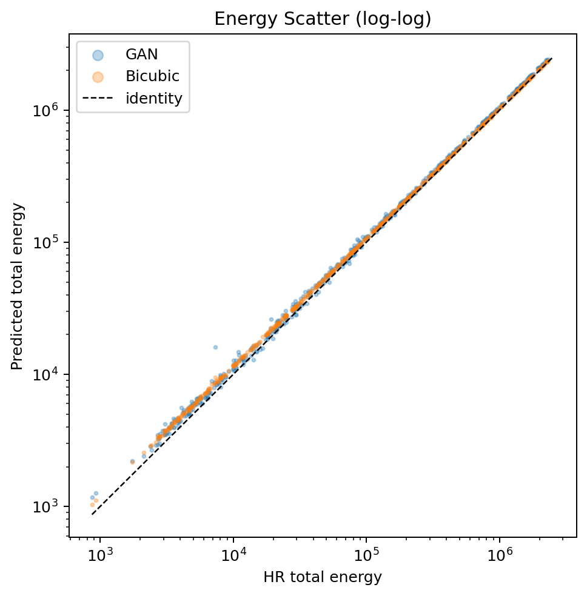
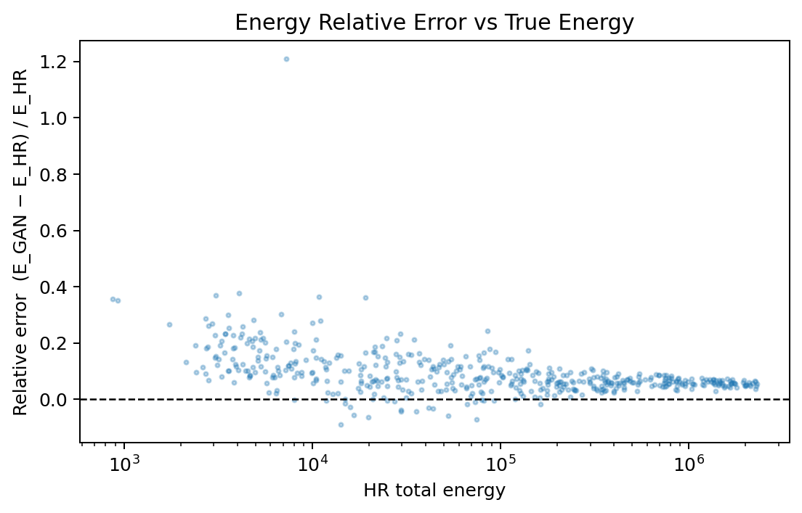

### Correlations
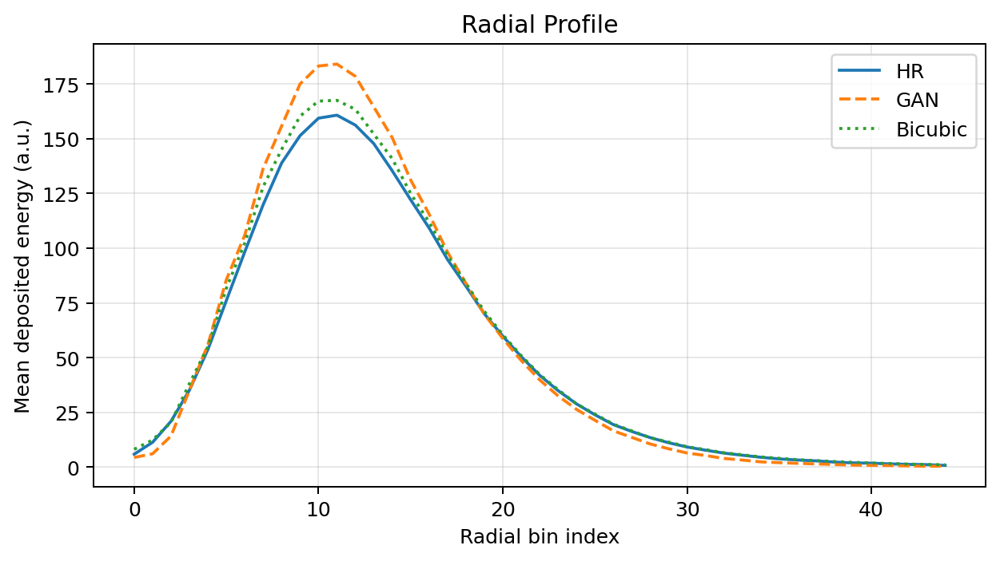
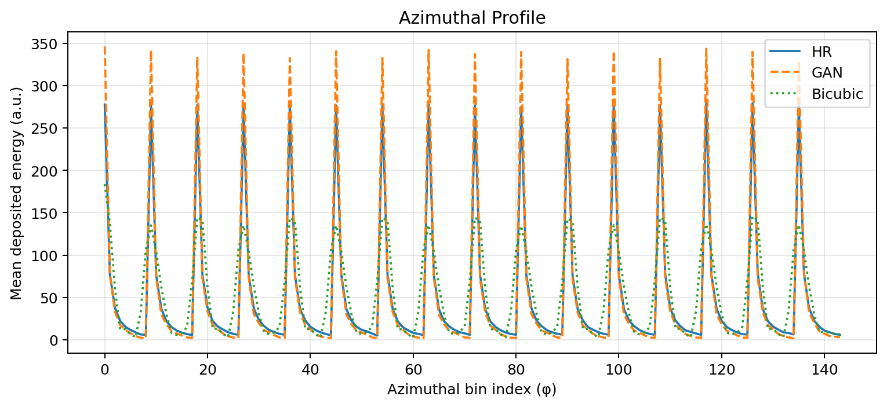
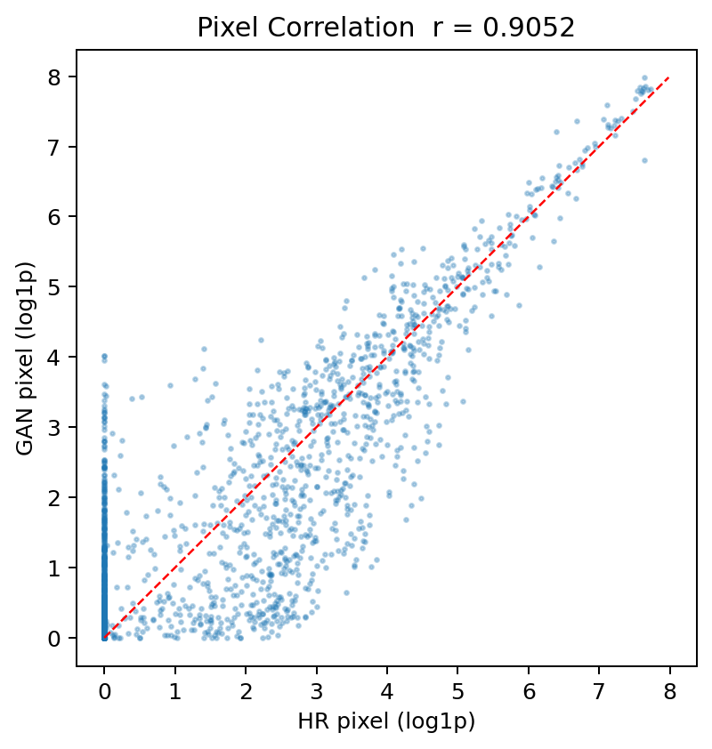
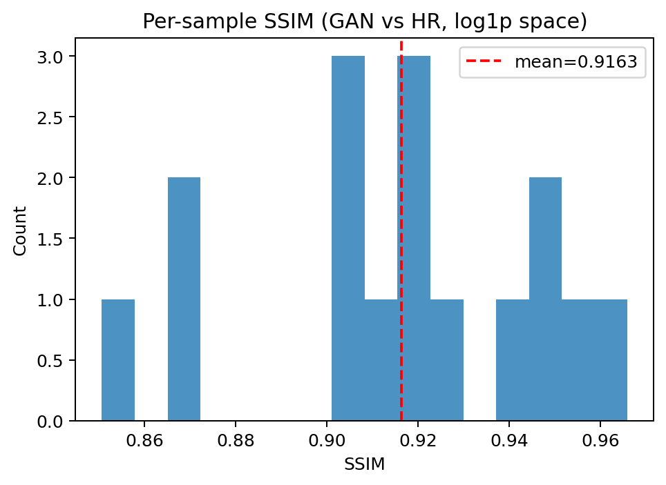
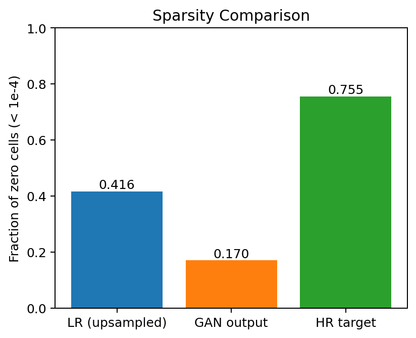

## Known limitations

1. **Synthetic LR has no real noise model** — LR is generated by bicubic downsampling of HR; real detector readout noise is not simulated.
2. **Single calorimeter layer replicated to 3 channels** — CaloChallenge Dataset 2 has one sampling layer; replicating it to 3 channels is an approximation of the parquet (ECAL/HCAL/Tracks) structure.
3. **Energy response not calibrated to 1.0** — the physics loss drives Σ_GAN/Σ_HR toward 1.0 but does not enforce it exactly; a dedicated calibration step (e.g. isotonic regression on E_GAN vs E_true) would be needed for publication.