# Experiment Report

**Dataset:** QCDToGGQQ CMS Jet Images  
**Run directory:** `experiments/2026-06-11/parquet_run_01`  
**Platform:** device=mps num_workers=0 pin_memory=False use_amp=False kaggle=False colab=False

## Run command

```bash
python train_srgan.py \
    --dataset-type parquet \
    --hr-size 125 125 \
    --epochs 5 \
    --batch-size 32 \
    --output-dir experiments/2026-06-11/parquet_run_01
```

## Dataset

| Property | Value |
| --- | --- |
| Name | QCDToGGQQ CMS Jet Images |
| N train | N/A (streaming) |
| N val | 500 |
| HR shape | (125, 125) |
| Scale factor | 2.0 |

## Training config

| Param | Value |
| --- | --- |
| epochs | 5 |
| batch_size | 32 |
| lr | 0.0002 |
| lambda_l1 | 50.0 |
| lambda_physics | 10.0 |
| gen_channels | 64 |
| gen_blocks | 8 |
| d_lr_ratio | 0.5 |
| n_critic | 1 |

## Best epoch

| Metric | Value |
| --- | --- |
| Best epoch | 5 |
| val_l1 | 0.10251 |
| val_psnr_norm | 2.14 dB |
| val_response | 0.9248 |

## Physics metrics

| Metric | GAN | Bicubic |
| --- | --- | --- |
| Response mean   | 0.9261 | 1.0880 |
| Response std    | 0.0313  | 0.0217  |
| Response median | 0.9301 | 1.0895 |
| |rel error| mean | 0.0740 | — |

### Per-class (QCD label)

| Class | N | GAN response μ | GAN response σ | Bicubic response μ |
| --- | --- | --- | --- | --- |
| class_0 | 257 | 0.9305 | 0.0264 | 1.0916 |
| class_1 | 243 | 0.9215 | 0.0351 | 1.0842 |

## Correlation metrics

| Metric | Value |
| --- | --- |
| Pearson r (pixel) | 0.6421 |
| SSIM mean | 0.9794 ± 0.0166 |
| Radial profile MSE | 0.0000 |
| Azimuthal profile MSE | 0.0000 |
| GAN sparsity | 0.735 |
| HR sparsity  | 0.983 |

## Figures

### Training
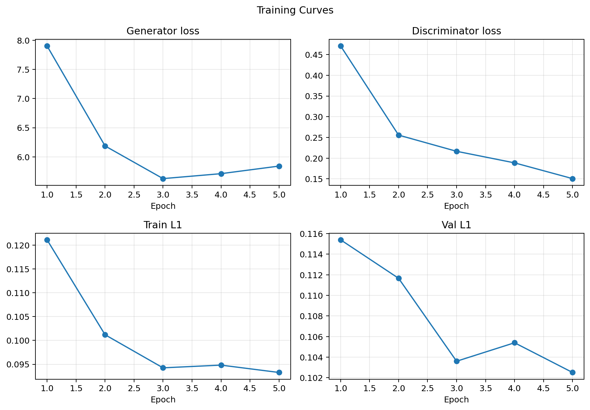
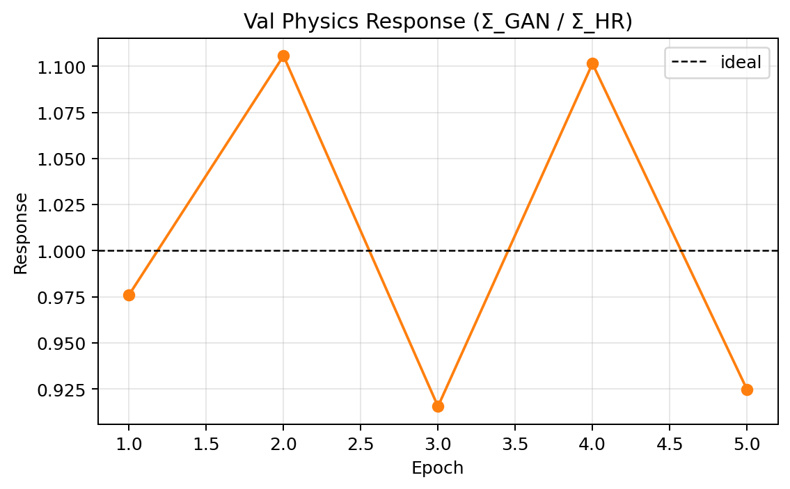
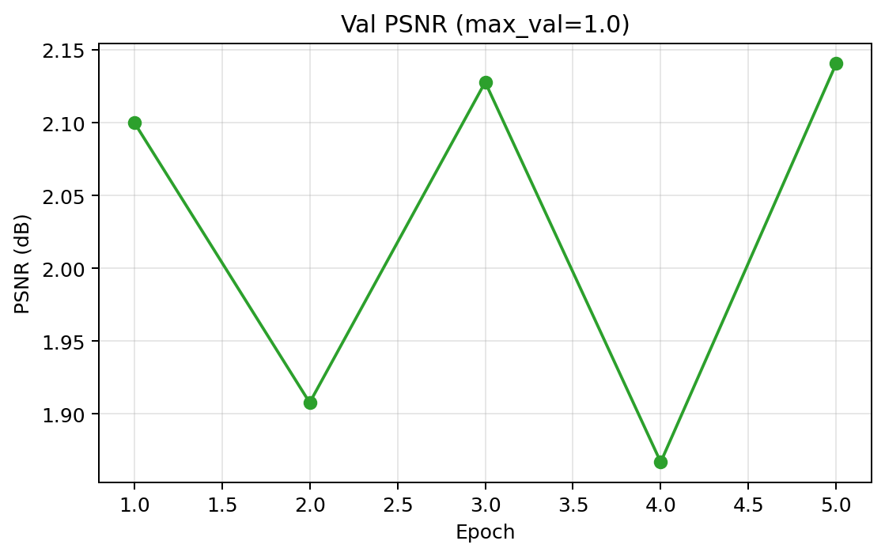

### Reconstruction
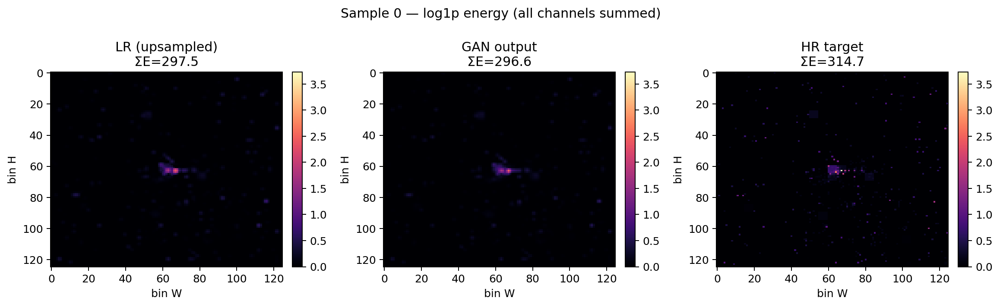
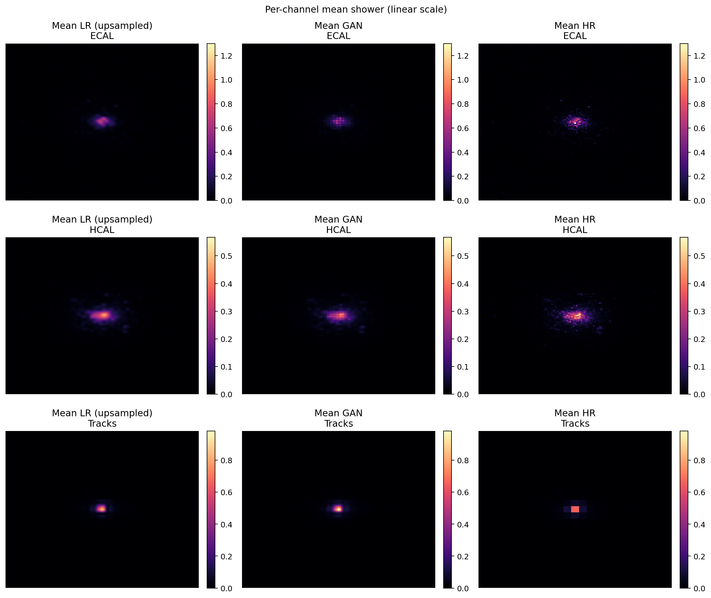
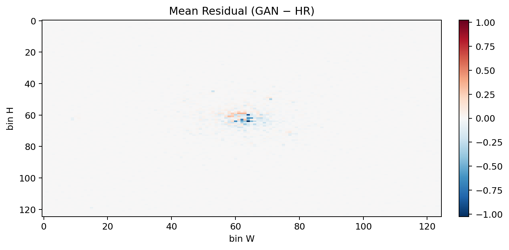

### Physics
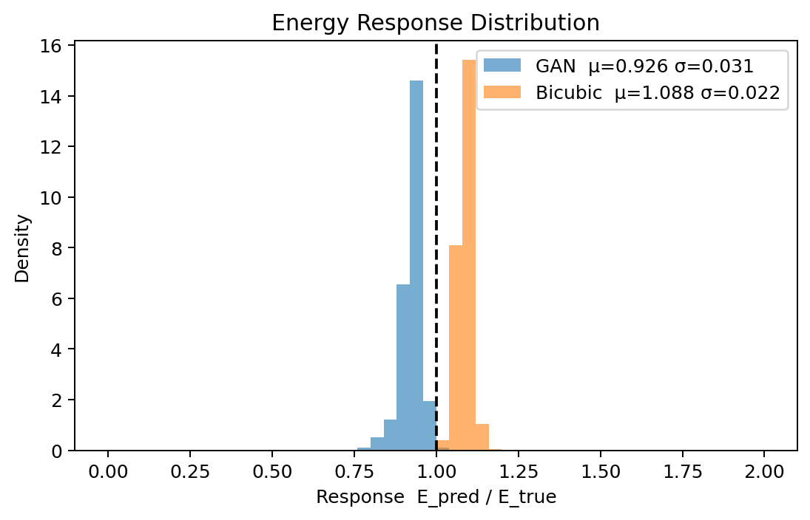
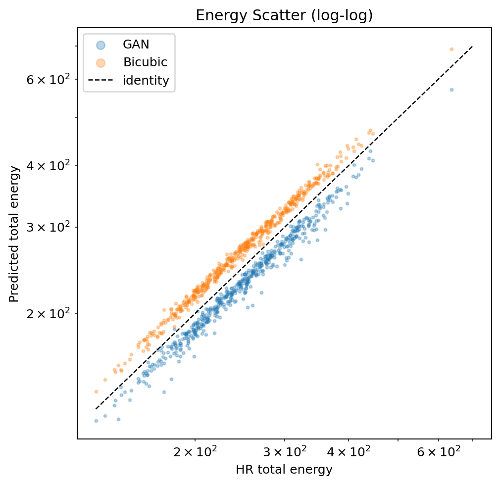
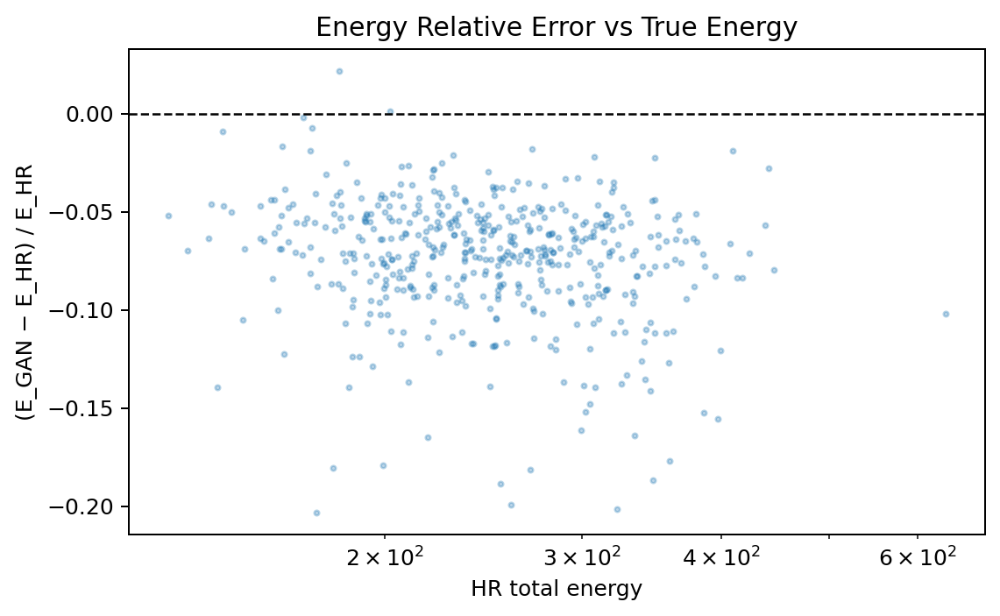

### Correlations
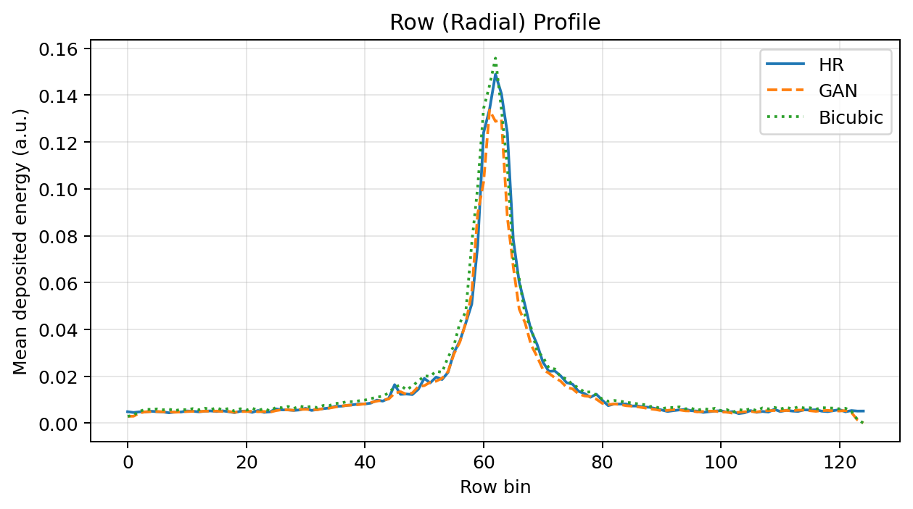
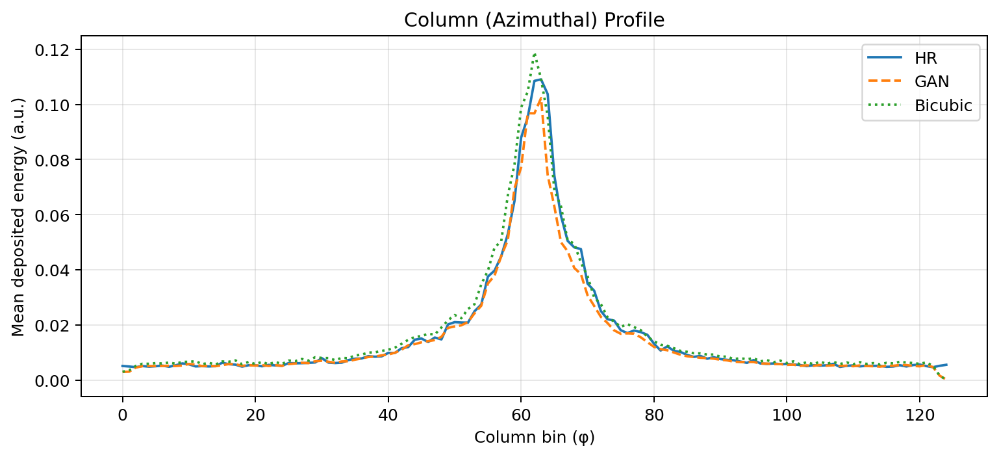
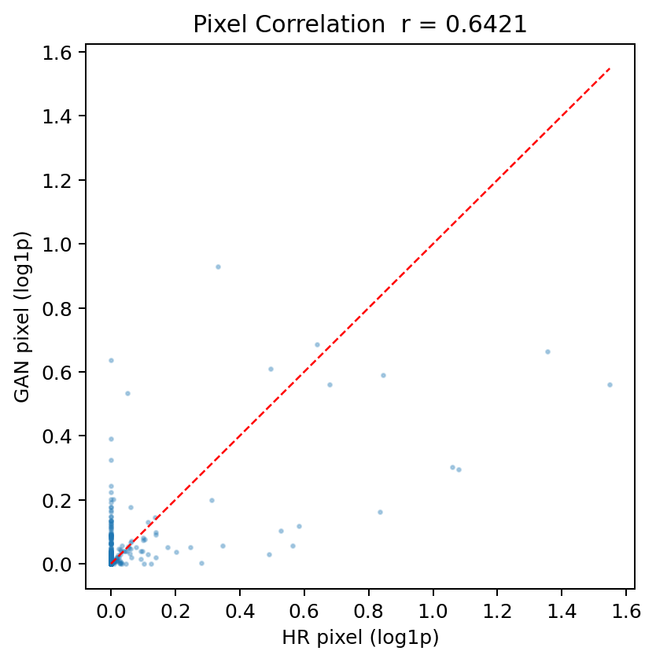
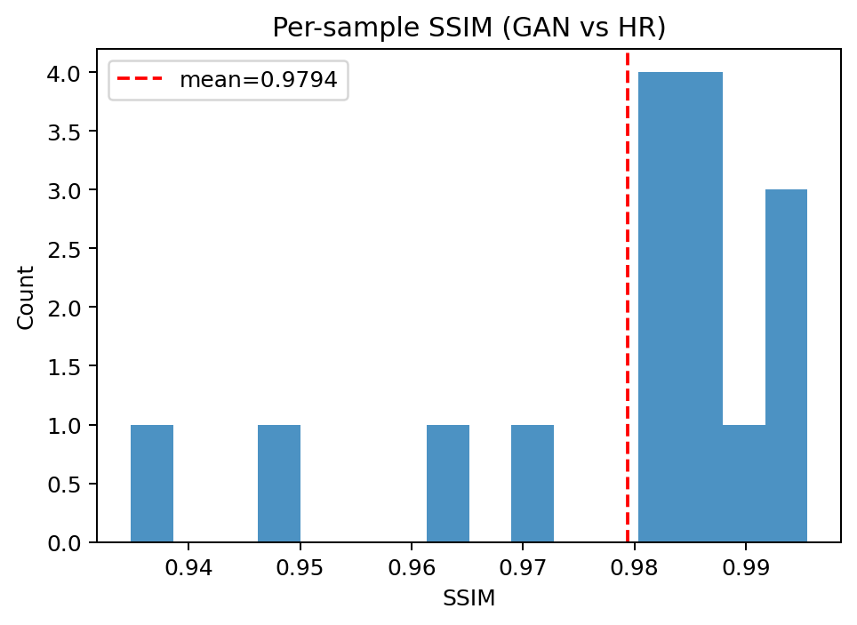
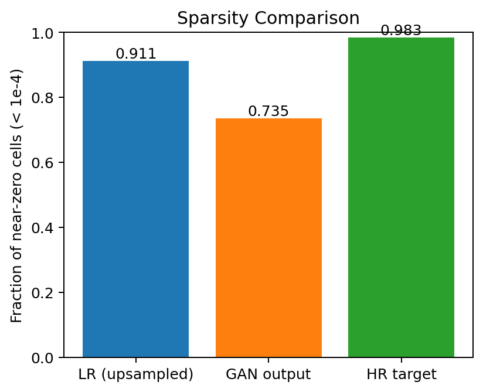
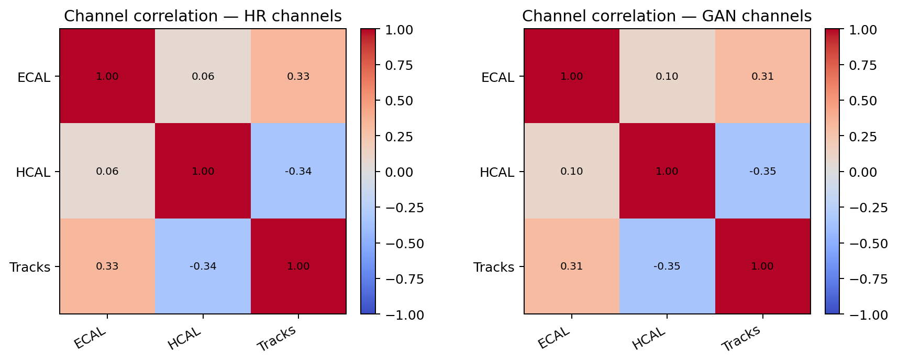

## Known limitations

1. **Synthetic LR has no real noise model** — LR is bicubic downsampled; real detector noise not simulated.
2. **Single calorimeter layer replicated to 3 channels** (HDF5 only) — approximation of ECAL/HCAL/Tracks.
3. **Energy response not calibrated to 1.0** — physics loss drives it toward 1.0 but a post-hoc calibration step is needed for publication-level accuracy.