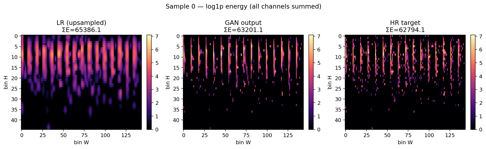
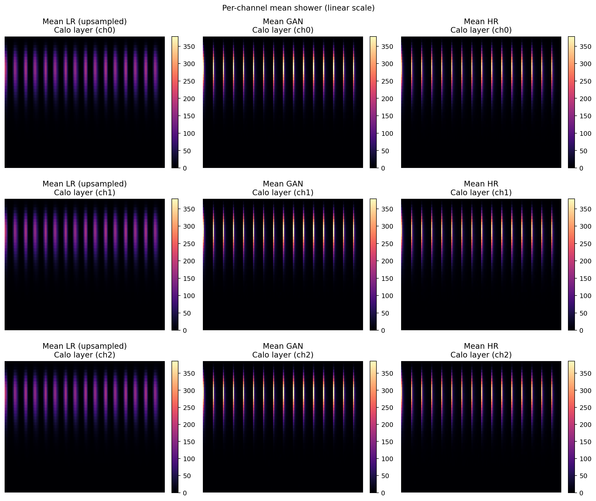
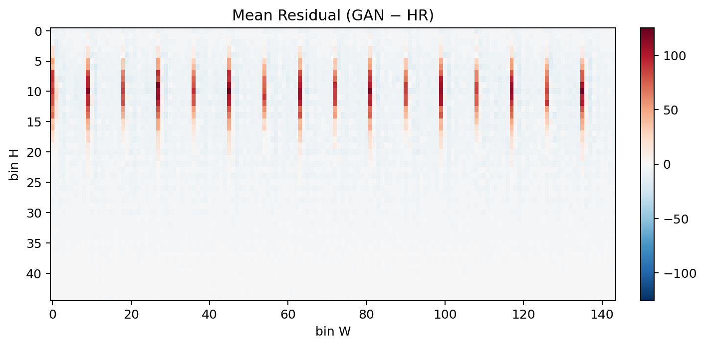
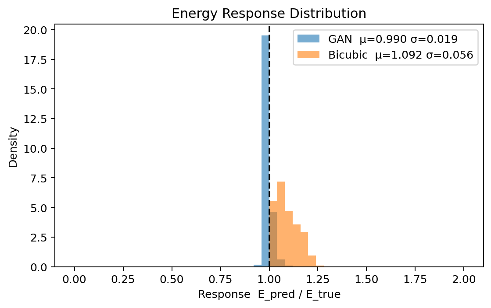
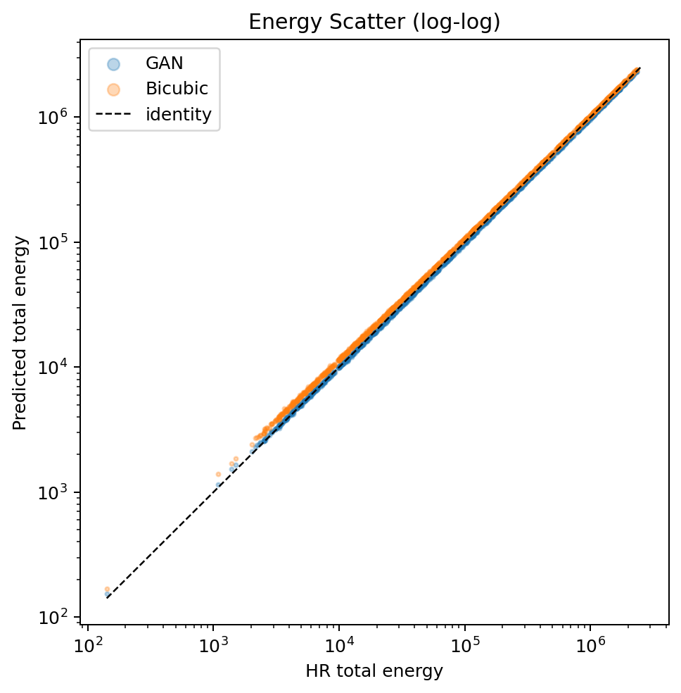
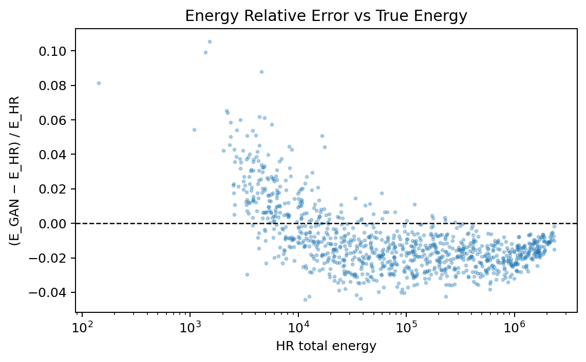

# Experiment Report

**Dataset:** CaloChallenge Dataset 2  
**Run directory:** `experiments/2026-06-12/hdf5_run_02`  
**Platform:** device=mps num_workers=4 pin_memory=False use_amp=False kaggle=False colab=False

## Run command

```bash
python train_srgan.py \
    --dataset-type hdf5 \
    --hr-size 45 144 \
    --epochs 20 \
    --batch-size 32 \
    --output-dir experiments/2026-06-12/hdf5_run_02
```

## Dataset

| Property | Value |
| --- | --- |
| Name | CaloChallenge Dataset 2 |
| N train | 170000 |
| N val | 30000 |
| HR shape | (45, 144) |
| Scale factor | 2.0 |

## Training config

| Param | Value |
| --- | --- |
| epochs | 20 |
| batch_size | 32 |
| lr | 0.0002 |
| lambda_l1 | 50.0 |
| lambda_physics | 15.0 |
| gen_channels | 64 |
| gen_blocks | 8 |
| d_lr_ratio | 0.5 |
| n_critic | 2 |

## Best epoch

| Metric | Value |
| --- | --- |
| Best epoch | 20 |
| val_l1 | 0.18980 |
| val_psnr_norm | 7.01 dB |
| val_response | 0.9913 |

## Physics metrics

| Metric | GAN | Bicubic |
| --- | --- | --- |
| Response mean   | 0.9904 | 1.0923 |
| Response std    | 0.0194  | 0.0557  |
| Response median | 0.9860 | 1.0777 |
| |rel error| mean | 0.0183 | — |

## Correlation metrics

| Metric | Value |
| --- | --- |
| Pearson r (pixel) | 0.8983 |
| SSIM mean | 0.9619 ± 0.0130 |
| Radial profile MSE | 7.2905 |
| Azimuthal profile MSE | 49.4670 |
| GAN sparsity | 0.544 |
| HR sparsity  | 0.752 |

## Figures

### Training


### Reconstruction




### Physics




### Correlations


## Known limitations

1. **Synthetic LR has no real noise model** — LR is bicubic downsampled; real detector noise not simulated.
2. **Single calorimeter layer replicated to 3 channels** (HDF5 only) — approximation of ECAL/HCAL/Tracks.
3. **Energy response not calibrated to 1.0** — physics loss drives it toward 1.0 but a post-hoc calibration step is needed for publication-level accuracy.