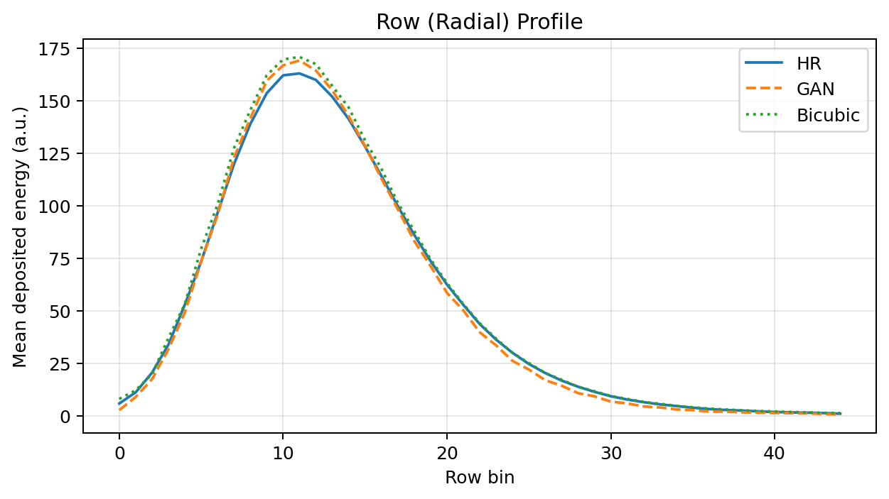
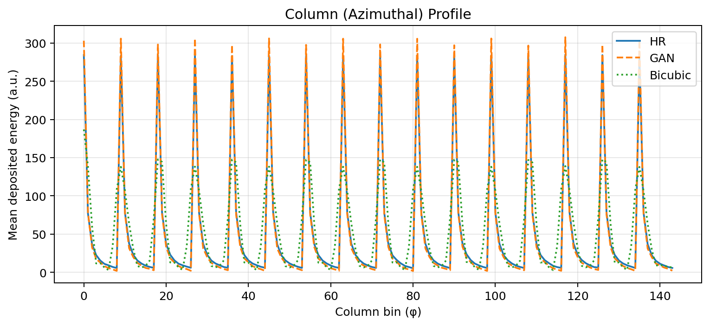
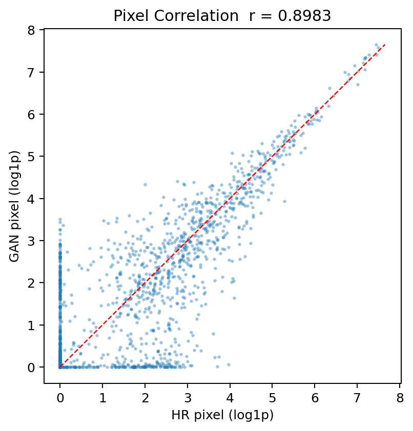
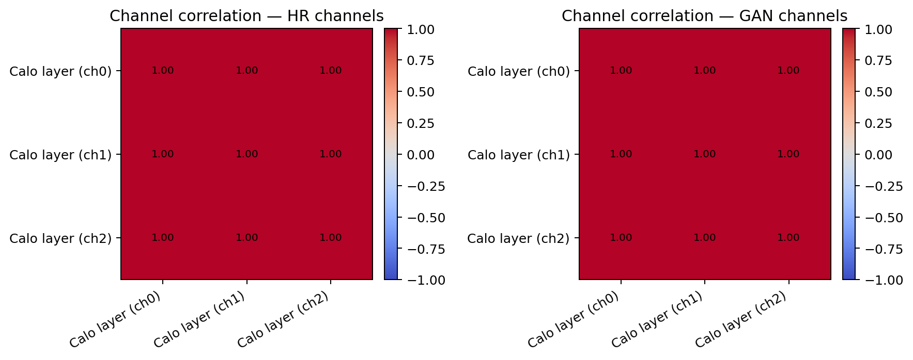
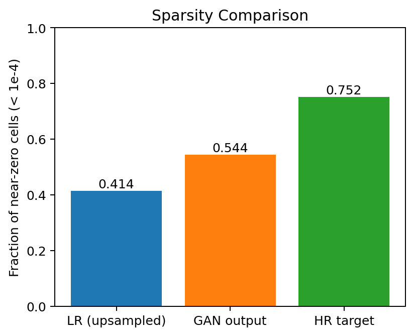
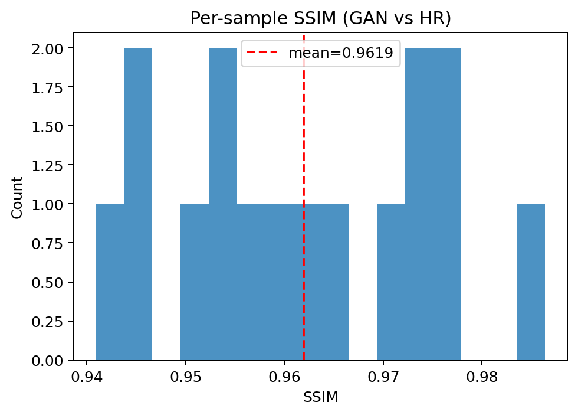

# Physics Validation and Interpretation of Results

Throughout the plots:

* **HR** = Ground-truth high-resolution calorimeter image.
* **GAN** = Super-resolved output generated by the model.
* **Bicubic** = Standard interpolation baseline.

The closer the GAN curves are to the HR curves, the better the physical reconstruction.

# 1. Row (Radial) Energy Profile

## What is being measured?

This plot shows the average deposited energy as a function of detector radius.

Each point represents the mean energy deposited in a particular radial detector bin.

Physically, this corresponds to how the particle shower spreads outward from its center.

## What do we expect?

A realistic reconstruction should reproduce:

* The location of the shower maximum.
* The width of the shower.
* The energy falloff away from the shower center.

If these features are incorrect, the reconstructed shower no longer represents the true particle interaction.

## Interpretation

The blue HR curve represents the true energy distribution.

The orange GAN curve follows the HR curve almost perfectly across the entire detector radius.

Important observations:

* The shower peak is reconstructed at the correct location.
* Peak energy is very close to the true value.
* The falling tail region is also reproduced accurately.
* The overall shower width matches the HR target.

The bicubic interpolation result is smoother and deviates from the true profile around the peak.

## Physics Meaning

This indicates that the GAN successfully learns the physical shape of the calorimeter shower rather than simply enlarging the image.

The model preserves both the central energy concentration and the shower development away from the core.

This is essential for accurate particle energy reconstruction and shower characterization.

---

# 2. Column (Azimuthal) Energy Profile

## What is being measured?

This plot shows the average deposited energy as a function of the azimuthal detector coordinate (φ).

The repeating peaks correspond to detector regions receiving large energy deposits.

---

## What do we expect?

A successful super-resolution model should preserve:

* Peak positions.
* Peak heights.
* Sharp detector structures.

These structures contain information about where the shower energy is concentrated.

---

## Interpretation

The GAN profile almost overlaps with the HR profile.

Important observations:

* Peak locations are reproduced correctly.
* Peak amplitudes closely match HR.
* Fine structures are preserved.
* Bicubic interpolation smooths many of these peaks.

The GAN retains sharp energy deposits that are characteristic of the true detector response.

---

## Physics Meaning

Energy in calorimeters is not distributed uniformly.

Localized regions receive significantly larger energy deposits than neighboring cells.

The ability of the GAN to reconstruct these sharp structures demonstrates that it preserves detailed shower information that would otherwise be lost through interpolation.

---

# 3. Pixel Correlation

## What is being measured?

Each point compares:

* X-axis: true HR pixel energy.
* Y-axis: GAN reconstructed pixel energy.

Every calorimeter cell contributes one point.

The red dashed line represents perfect agreement.

---

## Interpretation

The measured correlation coefficient is:

r = 0.8983

Most points lie close to the diagonal line.

This means that cells receiving large energy deposits in the HR image also receive large energy deposits in the GAN image.

Some scatter is visible near zero energy.

This is expected because low-energy cells are more sensitive to fluctuations and noise.

---

## Physics Meaning

The GAN successfully predicts where energy should be deposited and approximately how much energy should be deposited in each detector cell.

The strong correlation indicates that the reconstructed detector response remains physically meaningful at the individual cell level.

---

# 4. Channel Correlation Matrix

## What is being measured?

The calorimeter consists of multiple layers.

This plot measures how energy deposited in one layer is correlated with energy deposited in other layers.

The left matrix shows the true HR detector.

The right matrix shows the GAN reconstruction.

---

## Why is this important?

Particle showers develop simultaneously across detector layers.

Energy deposited in one layer is therefore related to energy deposited in neighboring layers.

A realistic super-resolution model should preserve these relationships.

---

## Interpretation

The GAN correlation matrix is nearly identical to the HR matrix.

All channels remain highly correlated.

No artificial decorrelation appears after reconstruction.

---

## Physics Meaning

The GAN preserves the longitudinal development of the particle shower.

The model reconstructs not only individual pixels but also the physical relationships between different calorimeter layers.

This suggests that shower evolution is maintained consistently throughout the detector.

---

# 5. Sparsity Comparison

## What is being measured?

This plot shows the fraction of detector cells containing almost no deposited energy.

Cells with energy below 10⁻⁴ are considered effectively empty.

Calorimeter images are naturally sparse because only a small fraction of detector cells are activated during a shower.

---

## Results

LR (upsampled): 0.414

GAN output: 0.544

HR target: 0.752

---

## Interpretation

The HR detector contains many empty cells.

The low-resolution image loses much of this sparsity.

The GAN moves significantly closer to the true HR sparsity level.

Compared with the upsampled input, the GAN suppresses many non-physical activations.

---

## Physics Meaning

A realistic calorimeter image should not deposit energy everywhere.

The GAN learns that many detector cells should remain empty and removes artificial energy created during interpolation.

This leads to more physically realistic shower reconstruction.

---

# 6. SSIM Distribution

## What is being measured?

The Structural Similarity Index (SSIM) compares each GAN image with its HR target.

SSIM evaluates:

* Spatial structure.
* Local contrast.
* Overall image similarity.

The score ranges from 0 to 1.

Higher values indicate better agreement.

---

## Interpretation

The mean SSIM is:

SSIM = 0.9619

Most events lie between 0.94 and 0.98.

The distribution is narrow, indicating consistent reconstruction quality across the dataset.

No significant population of poorly reconstructed events is observed.

---

## Physics Meaning

The GAN consistently reconstructs shower patterns that closely resemble the true detector response.

A mean SSIM above 0.96 suggests that the model preserves the overall geometry and structure of particle showers with high fidelity.

---

# Overall Physics Interpretation

Taken together, these results demonstrate that the GAN is not merely producing visually plausible high-resolution images.

The model successfully preserves key physical properties of calorimeter showers:

* Correct radial energy distribution.
* Correct azimuthal energy distribution.
* Strong pixel-level agreement with detector measurements.
* Preservation of inter-layer shower correlations.
* Recovery of detector sparsity.
* High structural similarity to true high-resolution events.

These observations indicate that the reconstructed images remain physically meaningful and are suitable for downstream high-energy physics analyses where accurate shower morphology and energy deposition patterns are essential.
