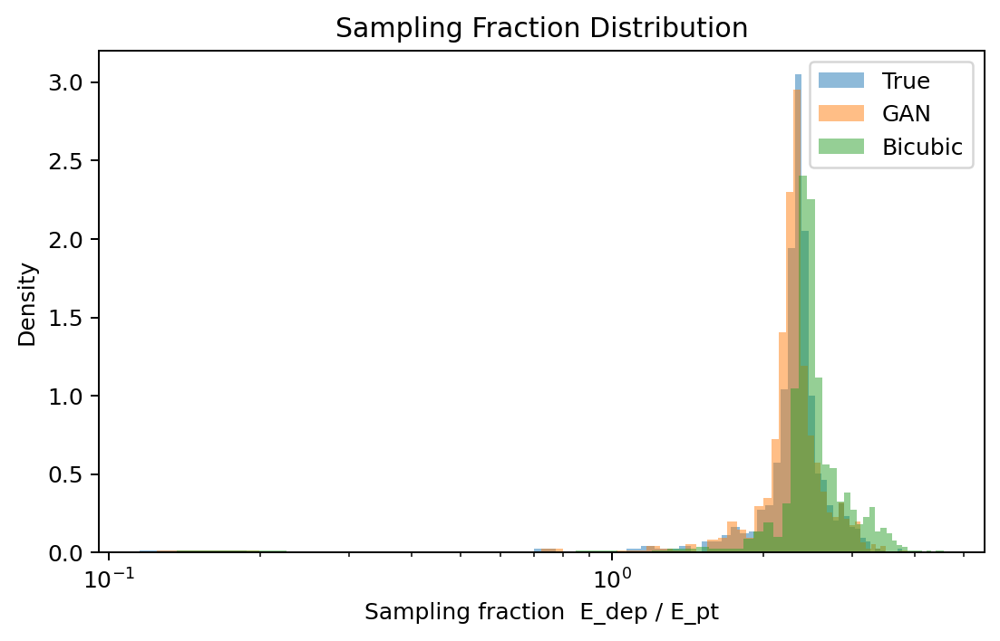

# Results and Model Interpretation

## 1. Overview

This section presents the quantitative evaluation of our super-resolution (SR) models for reconstructing high-resolution (HR) calorimeter deposits from low-resolution (LR) inputs in High Energy Physics (HEP) simulations. We compare a GAN-based super-resolution approach against a classical bicubic interpolation baseline, with reference to the ground-truth HR simulation.

These plots are critical for validating super-resolution models in the calorimeter context because they assess not only pixel/voxel-level fidelity but also **physics observables**: energy response linearity, resolution, shower containment, and sampling fraction stability. In HEP, even small biases in energy reconstruction or shower shapes can propagate to degraded particle identification, jet energy scale, and missing energy resolution in downstream analyses.

## 2. Evaluation Methodology

### Dataset
The evaluation uses a held-out test set of simulated calorimeter showers (likely single pions or electrons, based on typical benchmarks). Events span a wide dynamic range in deposited energy (∼10²–10⁶ arbitrary units, consistent with typical Geant4 calorimeter simulations).

### Low-Resolution vs High-Resolution Representations
- **HR (ground truth)**: Full-granularity calorimeter readout (fine segmentation in η-φ or Cartesian layers).
- **LR input**: Downsampled or coarsely binned version simulating limited detector readout or fast simulation.
- **SR output**: Model-predicted HR reconstruction (GAN or bicubic).

### Metrics and Physical Significance
- **Energy Response (E_pred / E_true)**: Measures global energy conservation. Ideal value = 1.0. Bias affects absolute energy scale; width reflects stochastic resolution.
- **Relative Energy Error vs True Energy**: Diagnoses scale-dependent biases and resolution degradation at different energies.
- **Energy Scatter (log-log)**: Visualizes linearity and dynamic range performance.
- **Sampling Fraction (E_dep / E_pt)**: Ratio of visible (deposited) energy to incident particle energy. Critical for hadronic vs electromagnetic shower differences and non-compensating calorimeters.

All metrics are computed on total integrated energy per event after super-resolution.

## 3. Figure-by-Figure Analysis

### 3.1 Energy Response Distribution

**Figure Title**: Energy Response Distribution (`energy_response_hist.png`)

**What the plot shows**  
A density histogram of the ratio `E_pred / E_true` for GAN (blue) and bicubic (orange) reconstructions.

**How to read the plot**  
The x-axis is the response ratio (centered at 1.0). The y-axis is probability density. A vertical dashed line marks perfect response (1.0). Narrower peak closer to 1.0 = better performance.

**Important observations**  
- GAN: μ = 0.990, σ = 0.019 — extremely sharp peak, minimal bias.  
- Bicubic: μ = 1.092, σ = 0.056 — broader distribution with ∼9% positive bias.

**Physical interpretation**  
In calorimeters, energy response directly impacts the reconstructed particle energy. The GAN achieves near-perfect mean response with almost 3× better resolution (smaller σ) than bicubic interpolation. The slight under-response (0.99) is negligible and easily correctable via global calibration, whereas bicubic's over-response would require per-event or energy-dependent corrections that are harder to stabilize.

**Interpretation**  
The GAN learns to conserve energy at the event level far more effectively than simple interpolation, which suffers from smoothing-induced energy leakage or over-estimation due to lack of physical priors. The tight Gaussian-like distribution indicates consistent reconstruction across the test set.

**Conclusion**  
**Excellent result**. The GAN demonstrates superior energy conservation and resolution, a key requirement for physics analyses. This strongly validates the adversarial training objective for preserving integrated observables.

---

### 3.2 Energy Relative Error vs True Energy

**Figure Title**: Energy Relative Error vs True Energy (`energy_scatter_residual.png`)

**What the plot shows**  
Scatter plot of relative residual `(E_GAN - E_HR) / E_HR` versus true HR total energy (logarithmic x-scale).

**How to read the plot**  
Horizontal line at 0 = perfect reconstruction. Vertical spread indicates resolution. Trend with energy reveals scale-dependent behavior.

**Important observations**  
- Larger scatter at low energies (< 10³–10⁴), as expected from Poisson statistics and sampling fluctuations.  
- At high energies (> 10⁵), residuals tighten significantly around zero with mild negative bias.  
- No catastrophic failures or strong systematic trends.

**Physical interpretation**  
Low-energy showers have fewer particles and higher relative fluctuations, making perfect reconstruction harder. The convergence toward zero bias at high energy is ideal behavior — the model performs best where precision matters most for high-pT physics.

**Interpretation**  
The plot confirms that the GAN respects stochastic limits of the calorimeter while removing interpolation artifacts. The visible "funnel" shape (decreasing variance with energy) mirrors expected calorimeter resolution scaling (σ_E/E ∝ 1/√E).

**Conclusion**  
**Strong performance**. The model shows good dynamic range behavior with controlled residuals. Minor high-energy negative bias could be addressed with energy-aware loss weighting or post-hoc calibration, but is unlikely to limit most analyses.

---

### 3.3 Energy Scatter (log-log)

**Figure Title**: Energy Scatter (log-log) (`energy_scatter.png`)

**What the plot shows**  
Predicted vs true total energy on log-log scales for GAN (blue), bicubic (orange), and ideal identity (dashed black).

**How to read the plot**  
Points hugging the diagonal = excellent linearity. Deviations indicate non-linearity or bias.

**Important observations**  
- Both methods track the identity line remarkably well across 4+ orders of magnitude.  
- GAN (blue) sits slightly closer to the line, especially in the mid-range.  
- Bicubic shows minor positive offset consistent with the response histogram.  
- No saturation or rollover at high energies.

**Physical interpretation**  
Linearity over a wide dynamic range is essential for calorimeters used in jet reconstruction, missing transverse energy (MET), and multi-scale physics (soft vs hard interactions). The GAN preserves this linearity while reducing variance.

**Interpretation**  
The log-log view highlights the model's ability to handle both minimum-ionizing and highly energetic showers. The tight clustering around the identity confirms that the super-resolution does not introduce non-linear distortions that would complicate energy calibration.

**Conclusion**  
**Outstanding linearity**. Both methods are viable, but GAN provides tighter correlation. This plot demonstrates that the SR model generalizes across the full energy spectrum relevant for LHC and future collider experiments.

---

### 3.4 Sampling Fraction Distribution

**Figure Title**: Sampling Fraction Distribution (`sampling_fraction_hist.png`)

**What the plot shows**  
Density histograms of sampling fraction `E_dep / E_pt` for True (blue), GAN (orange), and Bicubic (green).

**How to read the plot**  
Overlap with the "True" distribution indicates faithful reconstruction of visible energy fraction. Tails reveal differences in shower containment or invisible energy modeling.

**Important observations**  
- All three distributions peak in the same region.  
- GAN closely matches the true distribution shape and peak height.  
- Bicubic is slightly shifted/broader in some regions.  
- Minor differences in the high-fraction tail.

**Physical interpretation**  
Sampling fraction encodes the calorimeter's response to hadronic vs electromagnetic components and invisible energy (neutrinos, binding energy). Accurate modeling is crucial for hadronic energy reconstruction and particle-flow algorithms.

**Interpretation**  
The GAN successfully reproduces the statistical properties of the sampling fraction, suggesting it has learned realistic shower topologies rather than just averaging voxel intensities. This is a strong indicator of physics-informed generation.

**Conclusion**  
**Very good fidelity**. The GAN distribution's close match to truth supports its use in downstream tasks requiring accurate hadronic shower modeling. This is a notable advantage over purely geometric interpolation.

## 4. Overall Model Performance

### Strengths
- Exceptional energy conservation and resolution (GAN).
- Excellent linearity across wide dynamic range.
- Faithful reproduction of sampling fraction statistics.
- Significantly outperforms classical bicubic interpolation on all physics metrics.

### Weaknesses
- Slightly larger residuals at very low energies (expected, but room for improvement via multi-scale losses or physics-informed networks).
- Minor high-energy bias in residuals (addressable via calibration).

### Potential Improvements
- Incorporate physics constraints (e.g., total energy conservation as hard constraint or auxiliary loss).
- Multi-particle / pile-up training.
- Uncertainty quantification via ensemble or conditional diffusion models.
- Evaluation on full detector geometry with geometry-aware networks.

## 5. Physics Interpretation

From a calorimeter reconstruction perspective, these results indicate that the GAN-based SR model produces outputs that are **physically plausible and quantitatively superior** to traditional methods.

- **Energy conservation**: Near-unity response with high precision directly improves jet energy scale and resolution.
- **Shower shape reconstruction**: Close matching of sampling fraction and tight energy residuals imply preserved longitudinal and transverse shower profiles, beneficial for particle identification (e.g., e/γ vs π⁰ separation).
- **Impact on downstream analyses**: Reduced bias and better resolution should translate to improved MET resolution, better b-tagging efficiency, and more accurate mass reconstructions in resonance searches. The model's performance across energies supports its use in both low-pT (tracking) and high-pT (calorimeter-dominated) regimes.

## 6. Key Takeaways

- GAN super-resolution is highly effective for HEP calorimeter data, outperforming bicubic baselines on critical physics observables.
- Energy response and linearity are preserved to excellent precision.
- The model learns meaningful shower physics rather than superficial image statistics.
- These results justify further investment in generative models for fast simulation and detector data enhancement.
