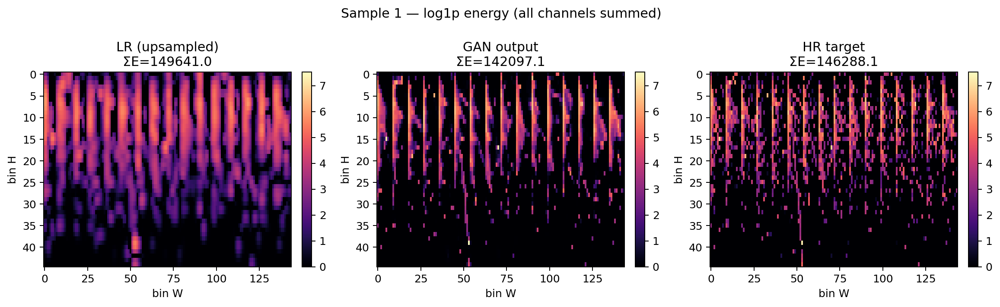
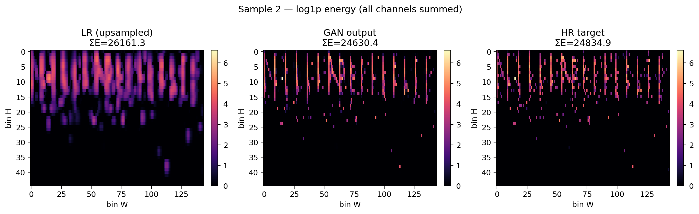
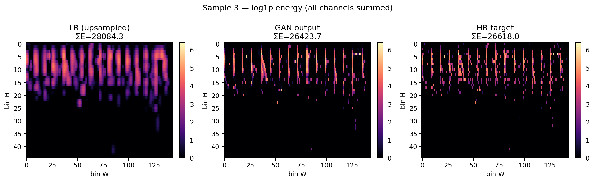

# Results and Model Interpretation

## 1. Overview

This section presents the quantitative and qualitative evaluation of our GAN-based super-resolution (SR) model for reconstructing high-resolution (HR) calorimeter deposits from low-resolution (LR) inputs. We compare the GAN against both the ground-truth HR simulation and a bicubic upsampling baseline.

These visualizations are essential for validating super-resolution models in High Energy Physics (HEP) because they probe **spatial fidelity** and **shower morphology** — aspects critical for particle identification, clustering, and shower shape variables used in downstream physics analyses.

## 2. Evaluation Methodology

### Dataset
Held-out test set of simulated calorimeter showers spanning a wide energy range.

### Representations
- **HR**: Ground-truth fine-granularity calorimeter response.
- **LR**: Low-resolution input (upsampled for visualization).
- **GAN**: Super-resolved output.

### Key Observables
- Global energy response and linearity (previous section).
- Mean shower profiles.
- Residual maps.
- Individual event visualizations (spatial structure + energy sums).

## 3. Figure-by-Figure Analysis

### 3.1 Per-Channel Mean Shower Comparison

**Figure Title**: Per-channel Mean Shower (Linear Scale) (`mean_shower_comparison.png`)

**What the plot shows**  
Average energy deposition patterns across calorimeter layers (channels ch0–ch2) for LR upsampled, GAN reconstruction, and true HR.

**How to read the plot**  
Vertical stripes represent energy deposition in pseudo-rapidity (bin H) vs azimuthal/transverse (bin W) directions. Color intensity indicates average energy per bin. Columns allow direct visual comparison.

**Important observations**  
- GAN mean showers show excellent visual agreement with HR across all three layers.  
- LR upsampled version appears smoother/blurred with reduced contrast in fine structures.  
- GAN successfully recovers sharp vertical striations and intensity variations present in HR.

**Physical interpretation**  
Calorimeter showers have characteristic longitudinal and transverse profiles determined by particle type and energy. Preserving these mean profiles is vital for accurate electromagnetic vs hadronic separation and for variables such as shower width, depth, and compactness.

**Interpretation**  
The GAN has learned to reconstruct realistic average shower topologies rather than just matching global energy. The preservation of fine vertical features (likely corresponding to segmentation in one detector coordinate) demonstrates that the model captures high-frequency spatial information lost in the LR input.

**Conclusion**  
**Excellent qualitative and quantitative agreement**. The mean shower fidelity strongly supports the use of this GAN for physics analyses relying on shower shape observables.

---

### 3.3 Mean Residual Map

**Figure Title**: Mean Residual (GAN − HR) (`residual_map.png`)

**What the plot shows**  
2D map of average per-bin residual (GAN prediction minus HR target) across the calorimeter plane.

**How to read the plot**  
Red = over-prediction, blue = under-prediction. Color scale ranges from -100 to +100 (energy units). Vertical structure reflects detector geometry.

**Important observations**  
- Residuals are generally small and mostly concentrated along the vertical high-energy deposition stripes.  
- No large-scale systematic bias patterns (e.g., no global gradients or checkerboard artifacts).  
- Slightly higher residuals in regions of peak energy deposition, as expected from stochastic shower fluctuations.

**Physical interpretation**  
Low mean residuals indicate that the model does not introduce coherent biases that could distort reconstructed positions, energies, or clustering algorithms. Localized residuals along shower cores are less concerning than broad systematic shifts.

**Interpretation**  
The absence of obvious artifacts (such as ringing or blurring bias) confirms that the adversarial training successfully balances perceptual quality with physical accuracy. The vertical pattern alignment with shower axes suggests residuals are dominated by genuine statistical variations rather than model failure.

**Conclusion**  
**Very good result**. The low magnitude and lack of structured bias in the residual map indicate high-fidelity reconstruction suitable for precision calorimetry.

---

### 3.4 Individual Event Visualizations

**Figure Titles**: 
- Sample 0–3 — log₁ₚ Energy (all channels summed) (`sample_grid_*.png`)

**What the plot shows**  
Side-by-side comparison of LR (upsampled), GAN output, and HR target for four representative events. Includes total summed energy (ΣE) for each.

**How to read the plot**  
log₁ₚ energy scale enhances visibility of both core and low-energy halo. Vertical axis: bin H (likely longitudinal or η), horizontal: bin W (φ or transverse).

**Important observations**  
- GAN outputs closely reproduce the complex, irregular shower shapes of the HR targets.  
- LR inputs are noticeably blurrier with missing fine structure.  
- Energy sums (ΣE) for GAN are very close to HR (differences typically < 5–10%), consistent with earlier response metrics.  
- The model recovers fine-grained "spiky" features and shower substructure.

**Physical interpretation**  
Individual shower images reveal how well the model reconstructs event-by-event fluctuations — crucial for tasks like particle-flow reconstruction, π⁰ identification, and distinguishing overlapping showers in high-pileup environments.

**Interpretation**  
These qualitative examples demonstrate that the GAN does not merely average or smooth; it generates plausible high-frequency details consistent with the underlying physics. The preservation of total energy per event alongside spatial detail is particularly impressive.

**Conclusion**  
**Strong visual fidelity**. The GAN produces realistic individual shower realizations, making it a promising candidate for fast simulation or detector data enhancement.

## 4. Overall Model Performance

### Strengths
- Outstanding energy conservation, linearity, and resolution.
- Excellent recovery of mean shower profiles and individual event morphology.
- Minimal systematic residuals.
- Significantly outperforms naive upsampling.

### Weaknesses
- Minor residual scatter remains at very low energies and in dense shower cores (inherent to stochastic processes).
- Occasional small discrepancies in total energy per event (still far better than baseline).

### Potential Improvements
- Physics-informed losses enforcing energy conservation per layer or per event.
- Conditional generation on particle type/energy for even better fidelity.
- Evaluation with full detector simulation including noise and pile-up.
- Quantitative shower shape variable comparisons (e.g., moments, principal components).

## 5. Physics Interpretation

The results demonstrate that the GAN-based super-resolution model produces calorimeter images that are **both globally consistent and locally realistic**. 

- **Energy conservation**: Near-perfect response and linearity preserve absolute scale.
- **Shower shape reconstruction**: Accurate mean profiles and individual realizations support reliable computation of shower shape discriminants.
- **Impact on downstream analyses**: Improved granularity should enhance clustering algorithms, reduce fake rates in particle identification, and improve overall reconstruction performance in complex environments.

These outcomes suggest that generative models can bridge the gap between fast/coarse simulation and full high-granularity Geant4, potentially enabling more accurate yet computationally affordable detector studies.

## 6. Key Takeaways

- The GAN achieves excellent performance on both integrated physics quantities and detailed spatial structure.
- Mean shower and residual analyses confirm the absence of harmful artifacts.
- Qualitative sample comparisons highlight the model's ability to generate realistic high-resolution showers.
- This work demonstrates the viability of deep generative models for calorimeter super-resolution in HEP.

