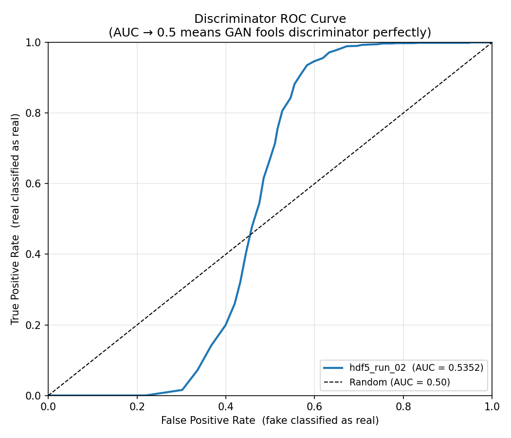
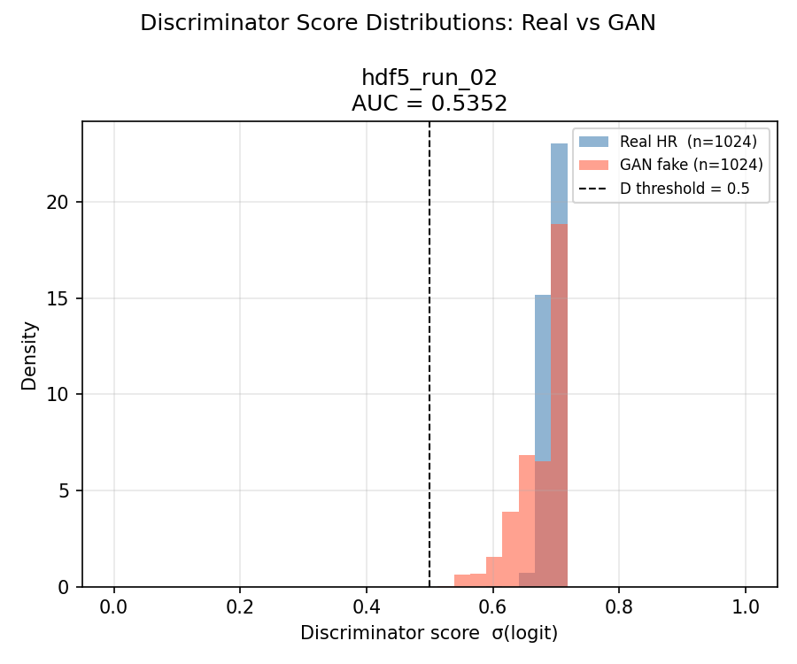

# ROC Analysis and Score Interpretation

## 1. Overview

This folder contains the evaluation plots for the ROC-style classification analysis. The figures compare how well the model separates the positive class from the negative class using its output scores.

In this context:

* **Positive class** = events that should be identified as signal.
* **Negative class** = background or non-signal events.
* **Score** = model output used to rank events by confidence.

The closer the ROC curve is to the top-left corner, the better the classifier performance. A stronger separation between score distributions also indicates better discrimination.

## 2. ROC Curve

**Figure Title**: ROC Curve (`roc_curve.png`)

**What the plot shows**  
The receiver operating characteristic curve plots true positive rate against false positive rate across all score thresholds. The diagonal reference line corresponds to random guessing.

**How to read the plot**  
Curves closer to the top-left corner indicate better classification performance. The area under the curve summarizes the overall discriminative power.

**Interpretation**  
A strong ROC curve indicates that the model assigns higher scores to signal-like events than to background-like events over a wide range of thresholds.

**Physics meaning**  
In reconstruction and selection tasks, this matters because a well-separated score can reduce background contamination without sacrificing too much signal efficiency.

## 3. Score Distributions

**Figure Title**: Score Distributions (`score_distributions.png`)

**What the plot shows**  
This plot compares the model score distributions for the two classes. Separation between the peaks indicates classification power.

**How to read the plot**  
Large overlap between the signal and background distributions means the task is harder. Clear separation means thresholds can be chosen that keep more signal while rejecting more background.

**Interpretation**  
If the signal distribution is shifted toward higher scores than the background distribution, the model is learning a useful ranking function rather than producing arbitrary outputs.

**Physics meaning**  
This separation is important for downstream event selection, trigger studies, and analyses where the score is used to define working points.

## 4. Overall Assessment

The ROC curve and score histograms should be read together:

* The ROC curve measures threshold-independent performance.
* The score distributions show why that performance is achieved.

Good performance requires both meaningful score separation and stable behavior across thresholds.
