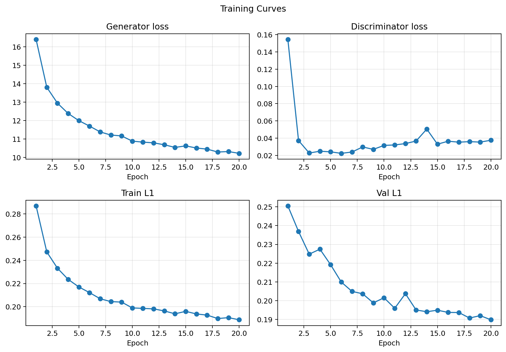
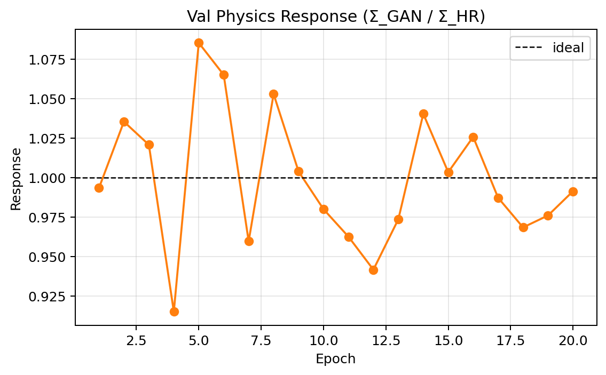
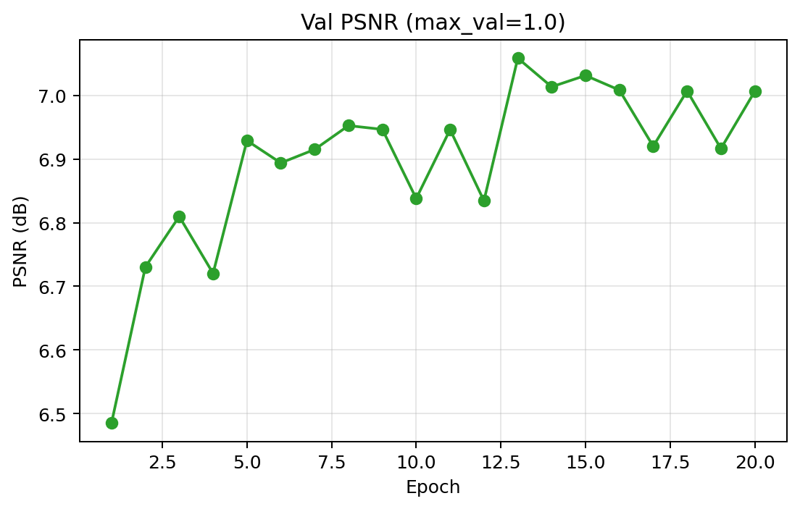

# Training Dynamics and Validation Metrics

## 1. Overview

This folder summarizes how the model behaved during training and validation. The plots track both optimization dynamics and physics-oriented validation metrics.

The three figures cover:

* Generator and discriminator training losses.
* Validation physics response across epochs.
* Validation PSNR across epochs.

Together, these plots show whether training is stable, whether the model converges smoothly, and whether reconstruction quality improves over time.

## 2. Training Loss Curves

**Figure Title**: Training Curves (`loss_curves.png`)

**What the plot shows**  
This figure contains four panels:

* Generator loss
* Discriminator loss
* Train L1 loss
* Validation L1 loss

Each curve is tracked across epochs to show optimization progress.

**How to read the plot**  
Falling generator and L1 losses indicate improved reconstruction. A discriminator loss that settles rather than collapsing suggests balanced adversarial training. Validation L1 is the most useful proxy for generalization.

**Interpretation**  
The generator loss decreases steadily from the first epoch and then flattens, which is the expected behavior for a converging SR model. Train L1 and validation L1 both decline smoothly, showing that the model is learning a stable mapping rather than overfitting early.

The discriminator loss drops quickly at the beginning and then remains in a narrow band with a modest bump around the middle of training. That pattern is consistent with a discriminator that remains active without destabilizing the generator.

**Physics meaning**  
For calorimeter reconstruction, this matters because stable optimization usually correlates with physically consistent outputs. The validation L1 curve suggests the model continues to improve on unseen events, which is the relevant criterion for downstream use.

## 3. Validation Physics Response

**Figure Title**: Val Physics Response (`physics_response_curve.png`)

**What the plot shows**  
This curve tracks the ratio of total reconstructed energy to total reference energy on the validation set across epochs.

**How to read the plot**  
The ideal response is 1.0. Values above 1 indicate over-response, values below 1 indicate under-response. Stability near the ideal line is more important than temporary fluctuations.

**Interpretation**  
The response oscillates around unity with small deviations, which means the model preserves total energy well throughout training. The early epochs are close to the target already, and later epochs show modest event-to-event variation rather than drift.

The visible fluctuations are normal for validation physics metrics, especially when the underlying shower sample is stochastic.

**Physics meaning**  
Near-unity response is essential for calorimetry. It indicates that the model is not only producing visually plausible images but also maintaining the integrated energy scale needed for energy calibration, jet reconstruction, and missing energy measurements.

## 4. Validation PSNR

**Figure Title**: Val PSNR (`psnr_curve.png`)

**What the plot shows**  
This curve measures peak signal-to-noise ratio on the validation set over epochs. Higher PSNR generally indicates closer agreement with the target image.

**How to read the plot**  
An upward trend means the reconstruction is becoming cleaner and more faithful to the reference. A plateau suggests the model has reached a stable quality level.

**Interpretation**  
PSNR rises quickly in the early epochs and then settles into a relatively stable band around the later epochs. That is a typical convergence pattern for image reconstruction models.

The small oscillations are not concerning. They reflect normal validation variability rather than a training failure.

**Physics meaning**  
While PSNR is not itself a physics observable, it is a useful proxy for pixel-level fidelity. In calorimeter SR, better image fidelity usually supports better shower morphology preservation and better downstream physics observables.

## 5. Overall Assessment

The training history shows:

* Smooth convergence of reconstruction losses.
* Stable adversarial behavior without collapse.
* Validation response close to the ideal energy scale.
* Improving and then saturating reconstruction quality as measured by PSNR.

Taken together, these plots indicate a well-behaved training run with physically meaningful validation performance.
