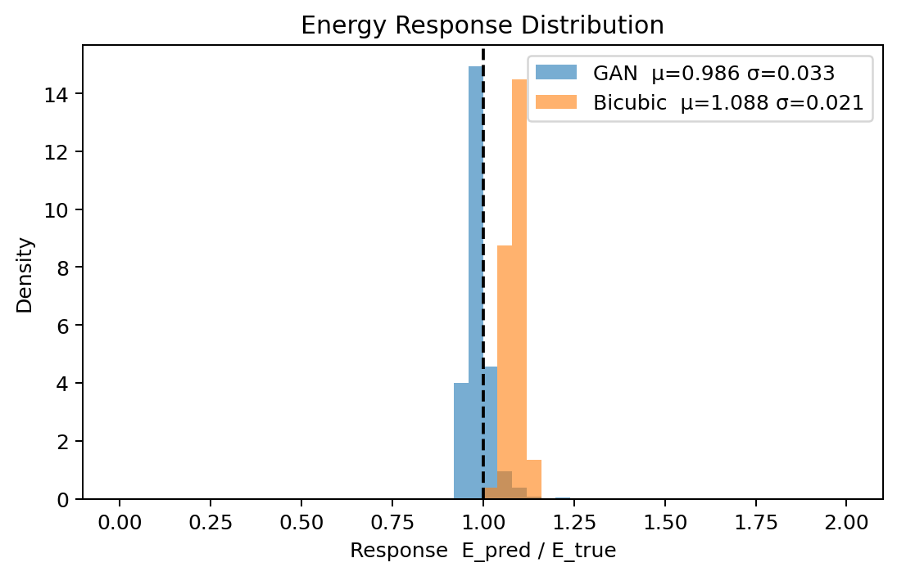
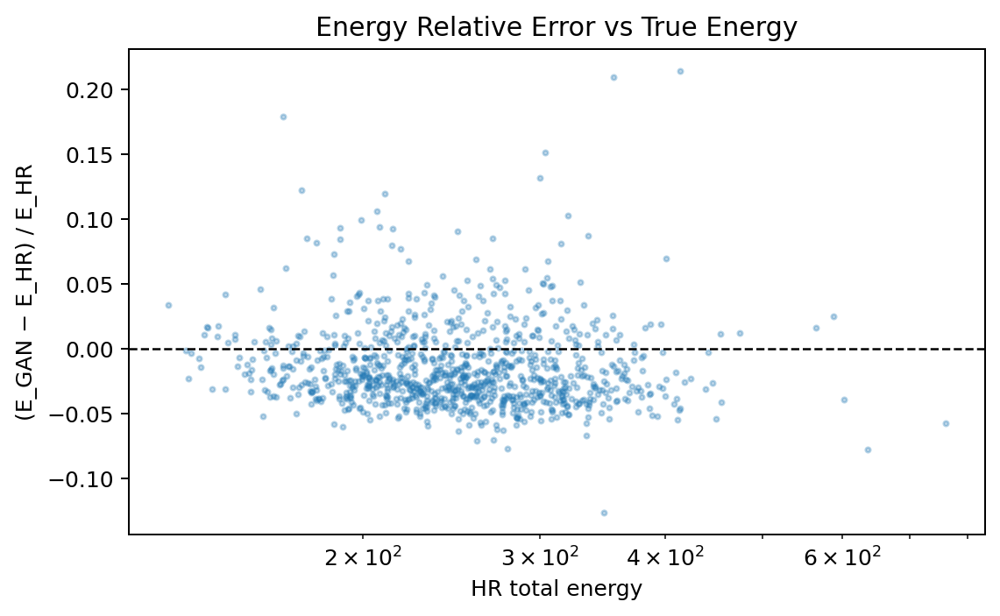
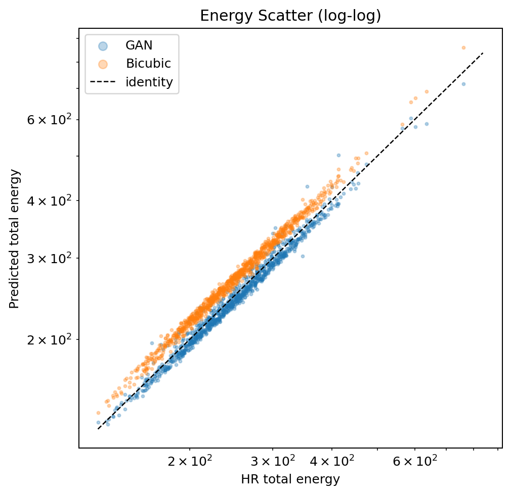
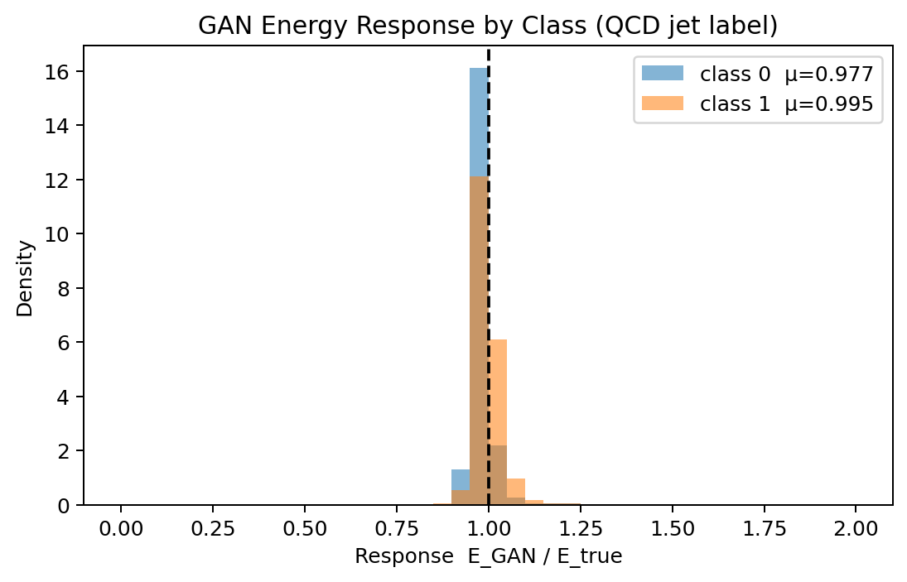
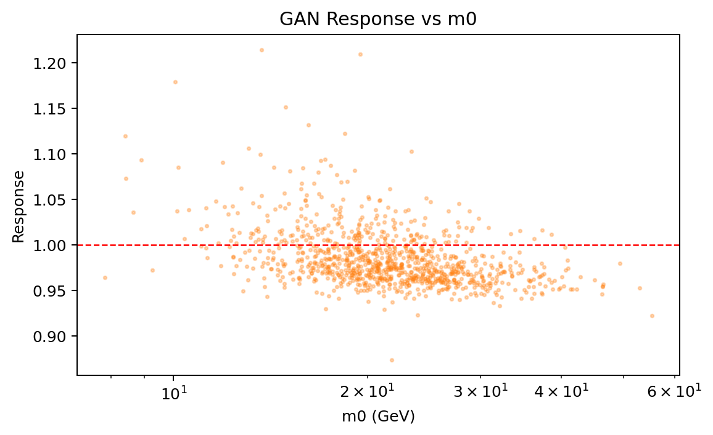
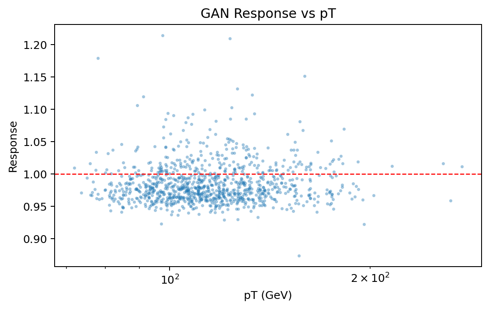
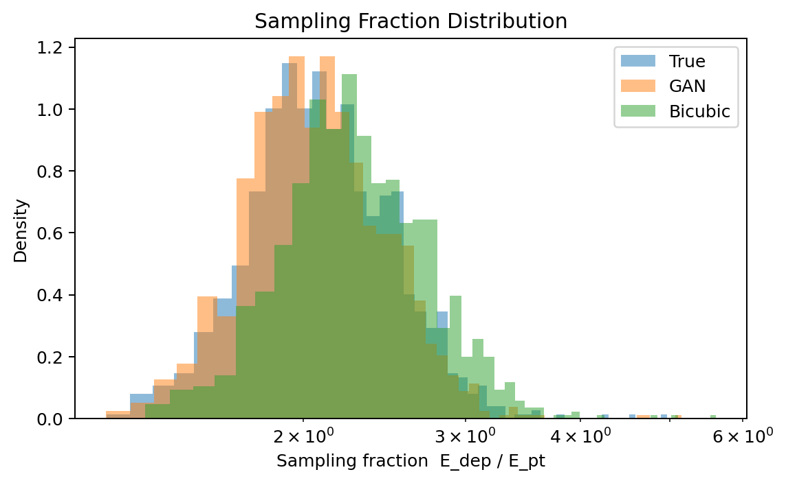

# Physics Validation and Interpretation

## 1. Overview

This folder contains the quantitative validation plots for the parquet run. The figures focus on whether the GAN preserves energy scale, linearity, class-dependent behavior, and sampling-fraction structure.

The main questions are:

* Does the reconstructed energy match the reference energy?
* Is the response stable across energy and class?
* Does the model preserve the statistical structure of the events?

## 2. Energy Response Distribution

**Figure Title**: Energy Response Distribution (`energy_response_hist.png`)

**What the plot shows**  
This histogram shows the distribution of the response ratio `E_pred / E_true` for GAN and bicubic reconstructions.

**How to read the plot**  
The dashed vertical line at 1.0 marks perfect energy conservation. A distribution centered near 1 with a small spread is preferred.

**Interpretation**  
The GAN distribution is tightly concentrated near unity, with only a slight under-response. Bicubic is shifted upward, indicating a stronger positive bias. The GAN therefore matches the reference energy scale more closely.

**Physics meaning**  
Near-unity response is important for calorimetric measurements because any systematic bias propagates into jet energy, missing energy, and downstream event reconstruction.

## 3. Energy Relative Error vs True Energy

**Figure Title**: Energy Relative Error vs True Energy (`energy_scatter_residual.png`)

**What the plot shows**  
This scatter plot compares the fractional residual `(E_GAN - E_HR) / E_HR` against the true HR total energy.

**How to read the plot**  
Points near the horizontal zero line indicate accurate reconstruction. The vertical spread shows how the residual changes with energy.

**Interpretation**  
The residuals remain centered close to zero across the energy range, with moderate scatter and a few outliers at higher energies. There is no strong energy-dependent drift, which is a good sign.

**Physics meaning**  
This suggests the GAN respects the basic energy scale over the tested range rather than failing at either low or high energy.

## 4. Energy Scatter

**Figure Title**: Energy Scatter (log-log) (`energy_scatter.png`)

**What the plot shows**  
This plot compares predicted and true total energy on logarithmic axes for GAN and bicubic models, with the identity line as reference.

**How to read the plot**  
Points close to the diagonal indicate good linearity and calibration. Systematic offsets from the diagonal indicate bias.

**Interpretation**  
Both models follow the identity line well, but the GAN tracks it more closely overall. Bicubic shows a visibly larger offset, especially at lower-to-mid energies.

**Physics meaning**  
Good linearity is critical because calorimeter response must remain stable across a wide dynamic range to support reliable physics reconstruction.

## 5. Class-Dependent Response

**Figure Title**: GAN Energy Response by Class (`response_by_class.png`)

**What the plot shows**  
This figure compares the response distributions for two event classes, labeled class 0 and class 1.

**How to read the plot**  
If the two histograms overlap closely and both remain near unity, the model is preserving the energy scale consistently across classes.

**Interpretation**  
Both classes cluster near response 1.0, with class 1 slightly closer to unity in the displayed summary. The class-dependent difference is small, which suggests the model is not introducing a strong class bias.

**Physics meaning**  
This is important if the classes correspond to different jet or particle categories, because a reconstruction bias that depends on class would distort comparisons and selection efficiencies.

## 6. Response vs m0

**Figure Title**: GAN Response vs m0 (`response_vs_m0.png`)

**What the plot shows**  
This scatter plot shows the GAN response as a function of `m0` in GeV.

**How to read the plot**  
The red dashed line at 1.0 marks ideal response. A flat cloud around that line indicates stable behavior across the parameter range.

**Interpretation**  
The response stays clustered around unity across the `m0` range, with modest scatter and no dramatic trend. That means the model is not obviously biased by the input mass scale.

**Physics meaning**  
Stable response across `m0` is useful when the model is applied to samples with different underlying kinematics or generator settings.

## 7. Response vs pT

**Figure Title**: GAN Response vs pT (`response_vs_pt.png`)

**What the plot shows**  
This plot shows the GAN response as a function of transverse momentum.

**How to read the plot**  
As with the previous plot, the dashed line at 1.0 indicates ideal response. A horizontal distribution near that line is the desired outcome.

**Interpretation**  
The response remains centered close to 1.0 over the pT range, with scatter but no strong slope. This indicates that the model is reasonably stable across different event hardness.

**Physics meaning**  
This matters because calorimeter response that changes with pT can distort reconstruction in analyses that compare soft and hard events.

## 8. Sampling Fraction Distribution

**Figure Title**: Sampling Fraction Distribution (`sampling_fraction_hist.png`)

**What the plot shows**  
This histogram compares the sampling fraction `E_dep / E_pt` for True, GAN, and Bicubic events.

**How to read the plot**  
The closer the GAN distribution is to the True distribution, the better the model preserves the statistical structure of the calorimeter response.

**Interpretation**  
The GAN is close to the True distribution and noticeably better aligned than the bicubic baseline. The model preserves the characteristic shape of the sampling-fraction spectrum instead of simply matching average energy.

**Physics meaning**  
Sampling fraction is a compact summary of how the detector converts particle energy into visible deposited energy, so matching it is a good sign that the model learned a physically meaningful reconstruction.

## 9. Overall Assessment

Taken together, these plots show that the GAN:

* Preserves the total energy scale well.
* Remains stable across energy, class, `m0`, and pT.
* Matches the true sampling-fraction structure more closely than bicubic interpolation.
* Avoids obvious large-scale biases in the reconstruction.

That makes the model suitable for downstream calorimeter studies where both calibration and shape fidelity matter.
