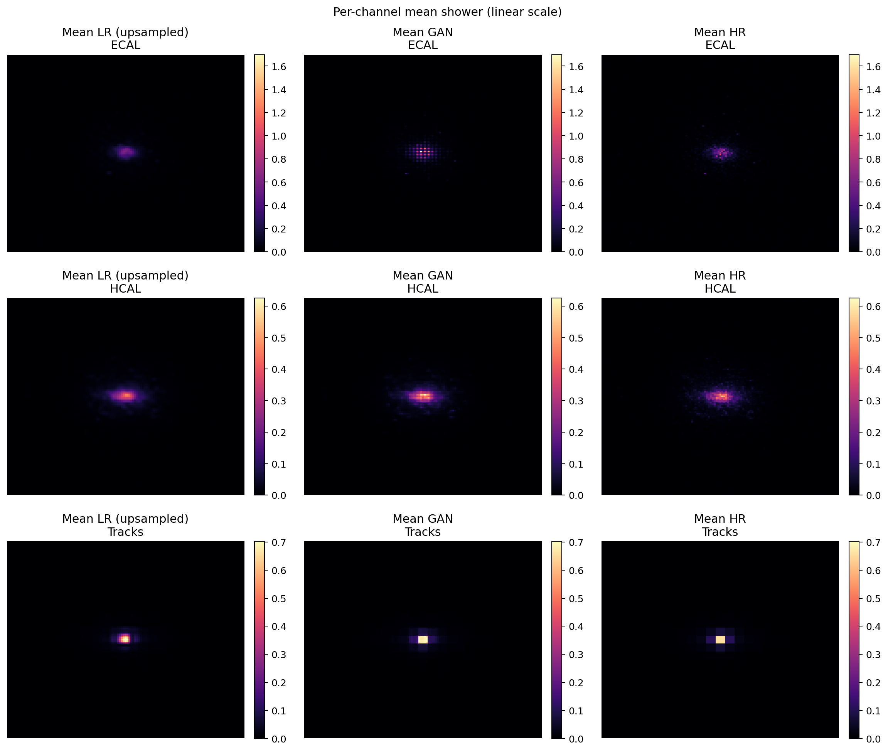
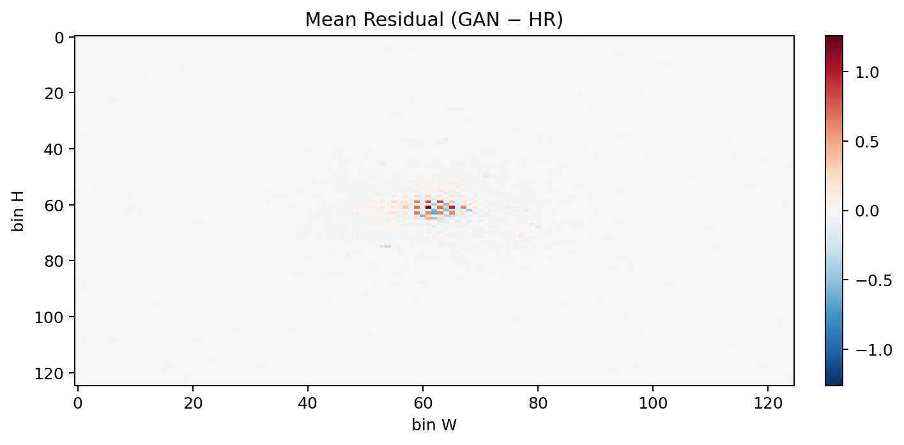
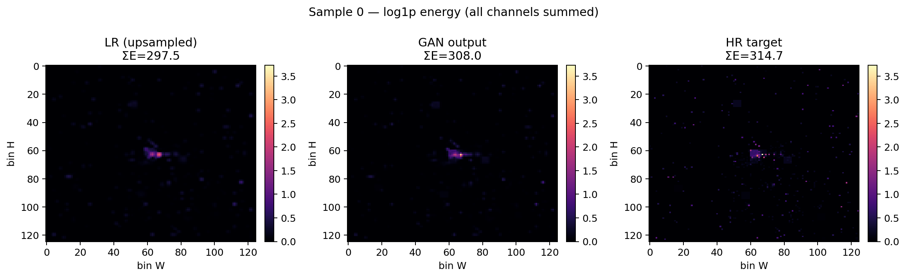
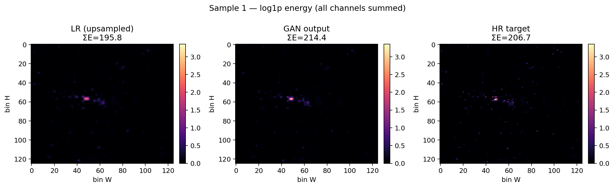
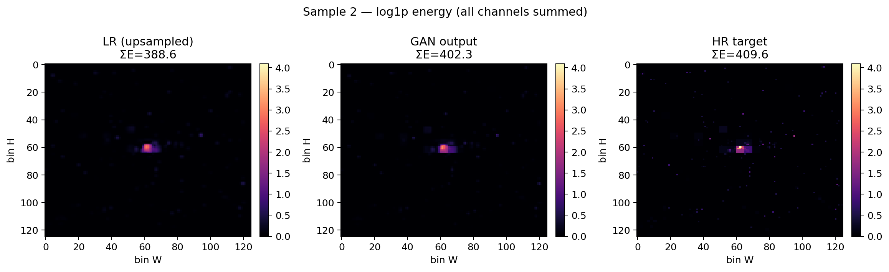
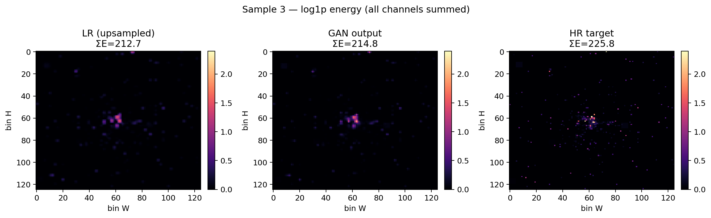

# Reconstruction Results and Visual Interpretation

## 1. Overview

This folder contains the main qualitative reconstruction figures for the parquet run. The plots compare low-resolution input, GAN reconstruction, and high-resolution target shower images.

The figures focus on two questions:

* Does the GAN recover the average shower structure?
* Does it preserve event-by-event detail and avoid systematic bias?

## 2. Mean Shower Comparison

**Figure Title**: Per-channel Mean Shower (Linear Scale) (`mean_shower_comparison.png`)

**What the plot shows**  
This figure compares the average reconstructed image for three detector components:

* ECAL
* HCAL
* Tracks

Each row shows the mean low-resolution input, the GAN output, and the high-resolution target.

**How to read the plot**  
Brighter regions indicate where energy is concentrated on average. Matching the bright core location and overall spread is the main sign of good reconstruction.

**Interpretation**  
The GAN reproduces the central shower core more sharply than the upsampled LR input and stays close to the HR target across all three detector components. The mean ECAL and HCAL shapes are especially well aligned, which suggests the model learned the dominant spatial structure of the shower rather than only smoothing the input.

The track view is also consistent: the GAN preserves the compact structure around the shower center instead of spreading activity too broadly.

**Physics meaning**  
This indicates that the model preserves detector-level shower morphology. That matters for downstream tasks such as energy calibration, shower-shape variables, and event classification.

## 3. Mean Residual Map

**Figure Title**: Mean Residual (GAN - HR) (`residual_map.png`)

**What the plot shows**  
This is the average per-bin residual map computed as `GAN - HR`.

**How to read the plot**  
Red regions indicate positive residuals where the GAN over-predicts energy. Blue regions indicate negative residuals where the GAN under-predicts energy. Values near zero mean the reconstruction is unbiased in that region.

**Interpretation**  
The residuals are concentrated near the shower core and remain small elsewhere. There is no strong large-scale pattern, which is what you want from a reconstruction model. The faint structure around the center is expected because that is where the model has to recover the most detailed energy pattern.

**Physics meaning**  
This suggests the GAN is not introducing broad spatial artifacts or systematic offsets across the detector plane. Localized residuals in the core are acceptable and typical for stochastic shower reconstruction.

## 4. Individual Event Samples

### 4.1 Sample 0

**Figure Title**: Sample 0 - log1p energy (all channels summed) (`sample_grid_0.png`)

**Interpretation**  
The GAN output closely follows the HR target in both the central deposit and the sparse surrounding activity. The total energy is much closer to HR than the raw LR input, while preserving the same overall shower location.

### 4.2 Sample 1

**Figure Title**: Sample 1 - log1p energy (all channels summed) (`sample_grid_1.png`)

**Interpretation**  
This event shows a compact core with a modest halo of lower-energy cells. The GAN reconstructs the main core well and retains the surrounding weak structure better than LR, without overfilling empty space.

### 4.3 Sample 2

**Figure Title**: Sample 2 - log1p energy (all channels summed) (`sample_grid_2.png`)

**Interpretation**  
This is a stronger shower with a denser central deposit. The GAN reproduces the main intensity pattern and the local asymmetry around the core more faithfully than the LR image.

### 4.4 Sample 3

**Figure Title**: Sample 3 - log1p energy (all channels summed) (`sample_grid_3.png`)

**Interpretation**  
The GAN preserves the shower center and nearby fine-grained activity while keeping the rest of the detector mostly empty, which is consistent with the HR target and preferable to the noisier LR input.

## 5. Overall Assessment

Taken together, these figures show that the GAN:

* Recovers the mean shower shape across detector components.
* Keeps residuals localized rather than introducing global bias.
* Reconstructs individual events with realistic spatial detail.
* Avoids the excessive smoothing seen in the LR upsampled baseline.

That combination is what you want for physically meaningful calorimeter super-resolution.
