# Classification-Based Evaluation of Multi-Scale Super-Resolution

**Author:** Rajveer Rathod · **Date:** 2026-06-27 · **Project:** GSoC 2026 — CMS Jet Super-Resolution

---

## 1. Motivation — why not just PSNR/SSIM?

Standard super-resolution (SR) metrics — **PSNR, SSIM, L1** — measure whether the
reconstructed image *looks* like the ground truth, pixel by pixel. For physics
data this is **not enough**: a generator can produce a smooth, plausible-looking
calorimeter image that scores well on pixels but has lost the subtle structure a
jet tagger needs to classify the jet.

This report introduces **tagging efficiency** as the physics-facing evaluation
metric. The idea is simple and directly tied to the downstream task:

> Train a jet tagger (classifier) on the real class label, then ask how taggable
> the **HR** (ground truth), **LR** (degraded input), and **SR** (generator
> output) images are. If SR taggability approaches HR and beats LR, SR is
> preserving *physics information*, not just pixels.

Three image sources, all compared at HR resolution (LR is bicubic-upsampled so a
single tagger architecture consumes any of them):

| Source | Meaning | Role |
|--------|---------|------|
| **HR** | Ground-truth high-resolution image | **Ceiling** — best taggability available |
| **LR** | Bicubic upsample of the low-res input | **Floor** — taggability of the degraded input |
| **SR** | Generator output | **Recovery** — how much SR restores |

**Headline metric:** `Tagging Efficiency = AUC_SR / AUC_HR` (using one fixed
tagger trained on HR). 100% means SR is as taggable as real HR.

---

## 2. Headline result — efficiency scales with input resolution

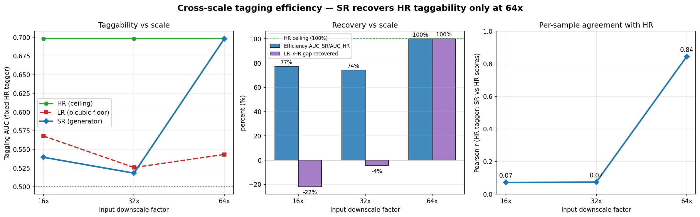

We trained three independent SR models (16×, 32×, 64× downscale factors) and
evaluated each with the classification pipeline. The single most important
finding:

> **Only the 64× model recovers HR taggability (100% efficiency). The 16× and 32×
> models do not — their SR output is no more taggable than the bicubic baseline.**

| Scale | AUC_HR | AUC_LR | AUC_SR | **Efficiency (SR/HR)** | **LR→HR gap recovered** |
|------:|:------:|:------:|:------:|:----------------------:|:-----------------------:|
| 16x | 0.698 | 0.568 | 0.539 | 77.3% | **−21.9%** |
| 32x | 0.698 | 0.526 | 0.518 | 74.2% | **−4.4%** |
| **64x** | 0.698 | 0.543 | **0.698** | **100.0%** | **+100.2%** |

**Reading the numbers:**
- *Efficiency* of ~75% at 16×/32× looks decent in isolation — but it is misleading.
- *Recovery fraction* exposes the truth: it is **negative** at 16× and 32×,
  meaning SR is **at or below the bicubic floor**. The generator hallucinates
  plausible detail that does not carry real jet-class information.
- At 64× both metrics hit 100%: SR is statistically indistinguishable from HR to
  the tagger.

This is exactly the kind of failure mode **PSNR/SSIM cannot see** — and the
reason this evaluation matters.

---

## 3. The evaluation features (one section per figure)

Each SR model produces the following figures in
`experiments/<run>/figures/classification/`. Below, the **64× model** is shown as
the success case and **32×** as the failure case, side by side, so the
difference is visible.

### 3.1 ROC curves — does SR preserve class-discriminative structure?

The ROC curve plots true-positive vs false-positive rate as the decision
threshold sweeps; area under it (AUC) summarizes separability. **SR (blue) sitting
on HR (green) and above LR (red) is the win condition.**

**64× (success) — SR overlaps HR:**

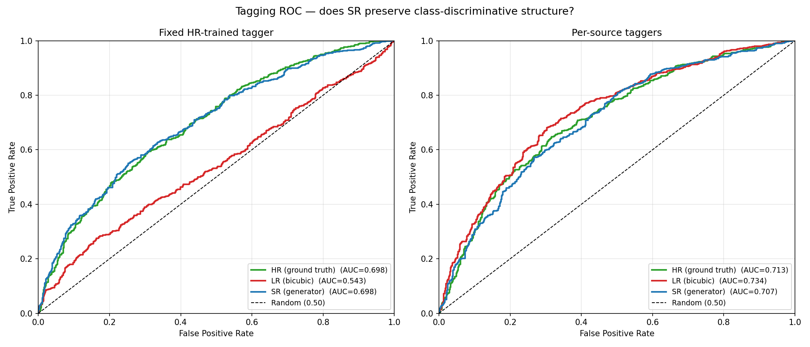

**32× (failure) — SR collapses onto LR:**

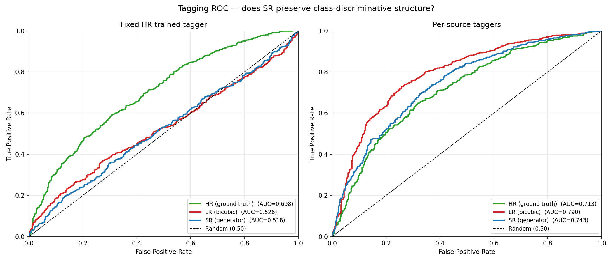

*Left panel = one fixed HR-trained tagger applied to all three sources (the
headline). Right panel = an independent tagger trained per source (see §3.7).*

### 3.2 AUC summary bar — the headline at a glance

Three AUC bars with the efficiency and recovery headline printed in the title.

**64×:**

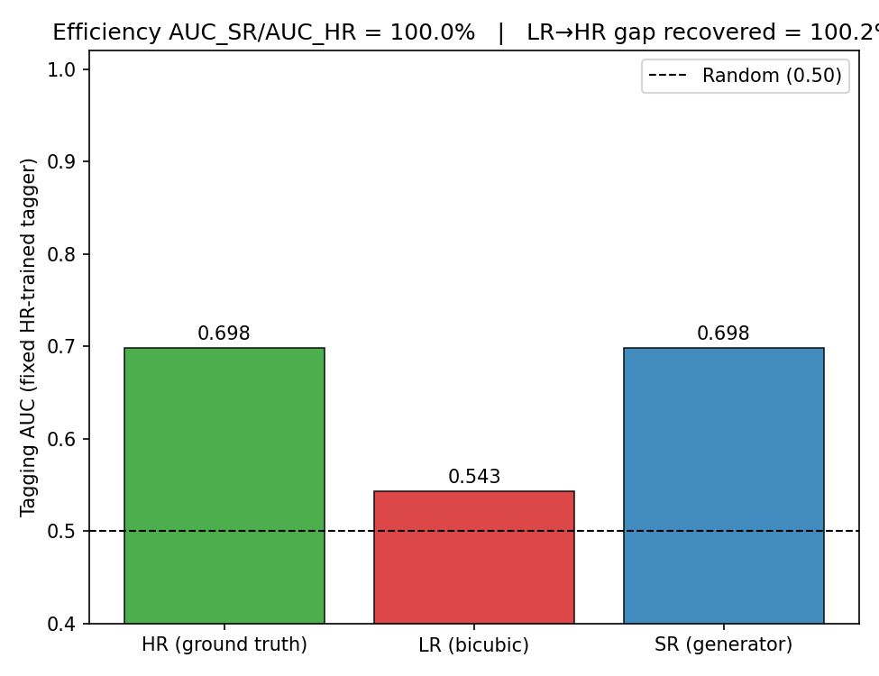

**32×:**

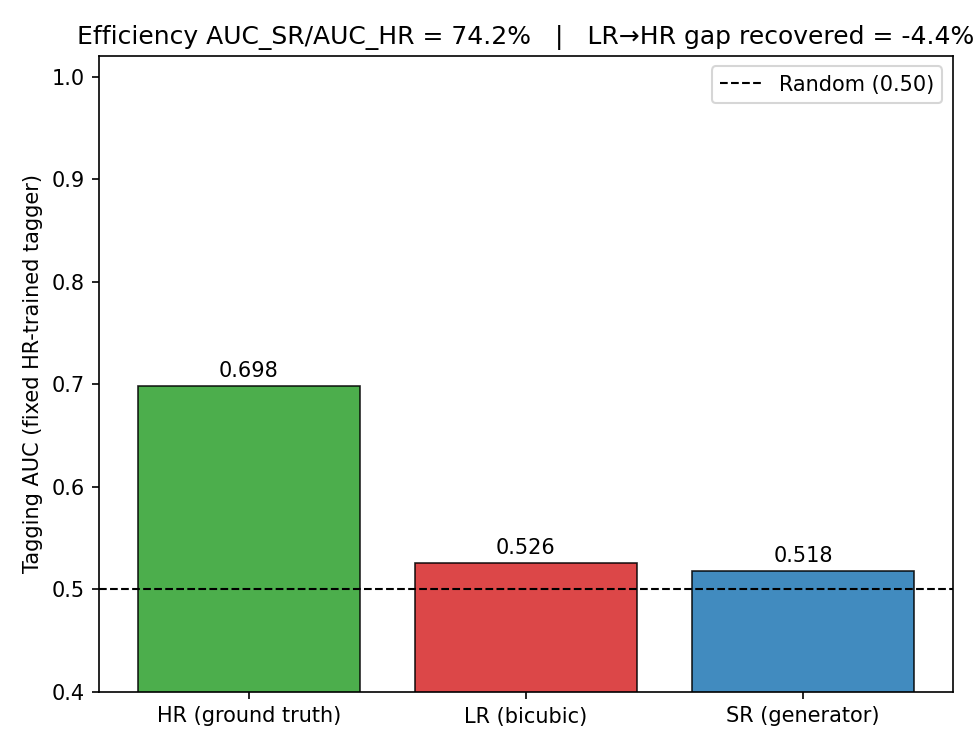

### 3.3 Score distributions — separability by source

Histograms of the tagger's score split by true class. **Wide separation between
the two class histograms = taggable.** On HR the classes separate; the question is
whether SR looks like HR or like LR.

**64× — SR classes separate like HR:**

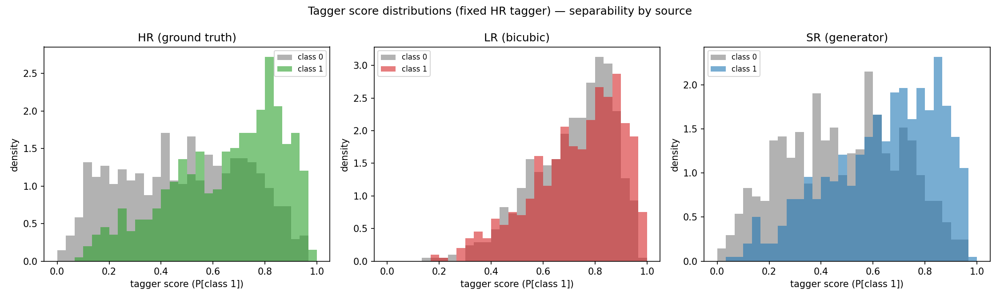

**32× — SR class histograms overlap (barely separable):**

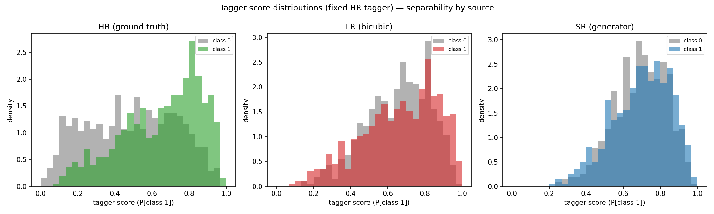

### 3.4 Confusion matrices — accuracy & F1 at the operating point

Confusion matrix plus accuracy / precision / recall / F1 at the **Youden-J optimal
threshold**, per source. Concrete classification performance, not just AUC.

| | 64× SR | 32× SR |
|---|:---:|:---:|
| Accuracy | **0.65** | 0.54 |
| F1 | **0.61** | 0.30 |

**64×:**

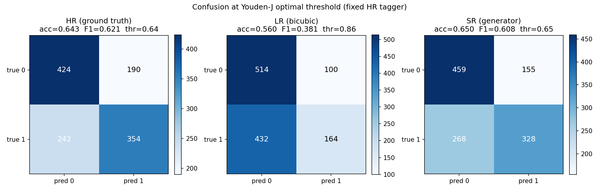

**32×:**

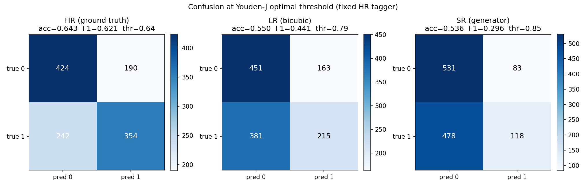

### 3.5 Working-point analysis — background rejection (HEP-standard)

The metric particle physicists actually quote: **background rejection
`1/ε_B` at a fixed signal efficiency `ε_S`** (here 50%). Higher = better. The
right panel is the standard HEP ROC view (log-scale rejection vs signal
efficiency).

| Scale | HR | LR | **SR** |
|------:|:--:|:--:|:------:|
| 64x `1/ε_B@50%` | 4.3 | 2.2 | **4.5** |
| 32x `1/ε_B@50%` | 4.3 | 2.2 | **2.1** |

At 64× SR matches HR's rejection (4.5 ≈ 4.3); at 32× SR is at the LR floor.

**64×:**

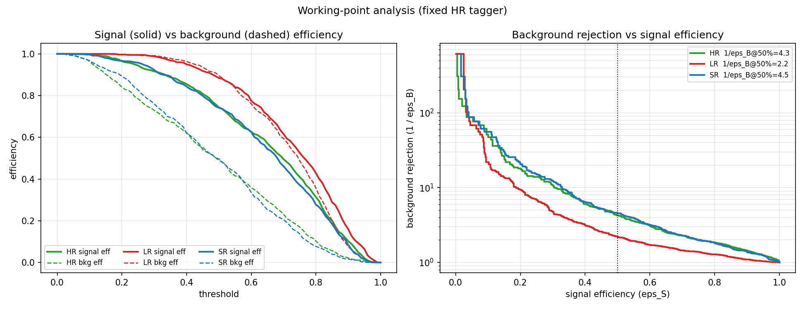

**32×:**

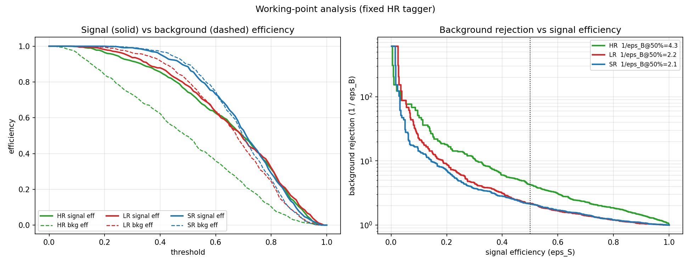

### 3.6 Calibration — does SR shift the tagger's confidence?

Reliability curves with Expected Calibration Error (ECE, lower = better). Tests
whether the tagger's confidence stays trustworthy on SR images.

| Scale | ECE_HR | ECE_LR | **ECE_SR** |
|------:|:------:|:------:|:----------:|
| 64x | 0.095 | 0.255 | **0.086** |
| 32x | 0.095 | 0.227 | **0.224** |

At 64× SR is *as well-calibrated as HR*; at 32× it is as miscalibrated as LR.

**64×:**

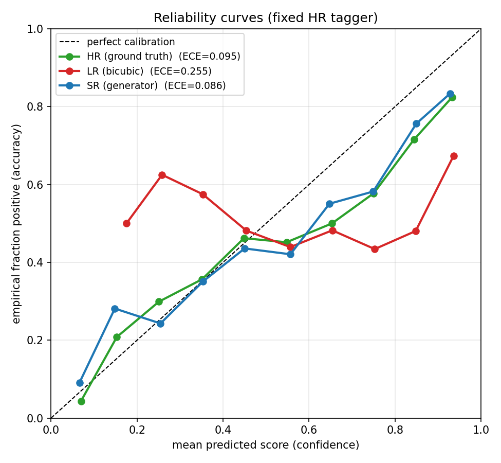

**32×:**

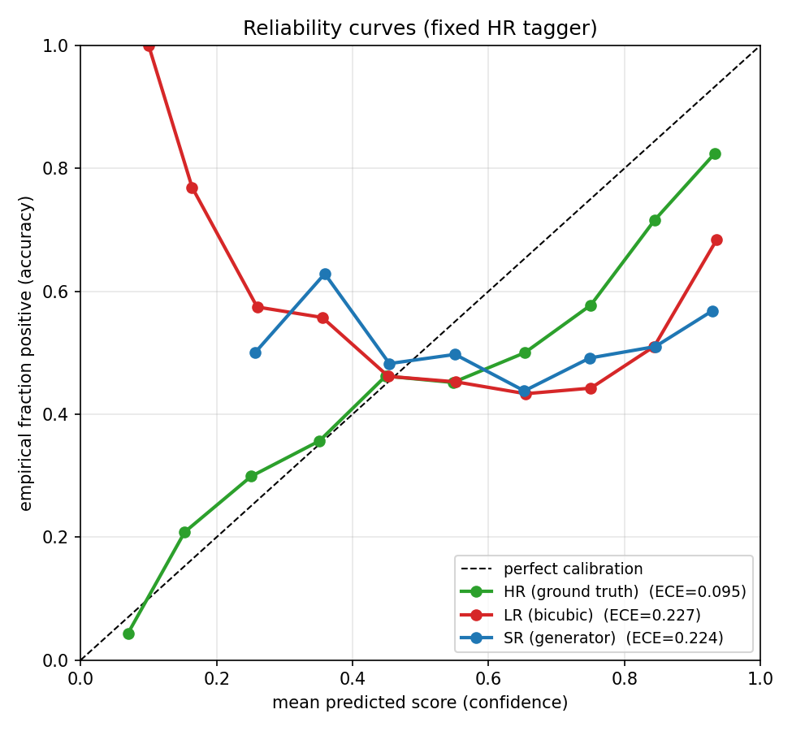

### 3.7 Per-sample score agreement — the strictest test

For each image, plot the HR tagger's score on SR vs its score on HR. Points **on
the diagonal** mean SR fools the tagger *the same way, sample by sample* — a much
stricter test than matching aggregate AUC.

| Scale | Pearson r (SR vs HR) |
|------:|:--------------------:|
| 16x | 0.07 |
| 32x | 0.07 |
| **64x** | **0.85** |

This is the clearest single number in the study: at 64× the per-sample agreement
is **0.85**; at 16×/32× it is essentially **zero** — SR scores are uncorrelated
with HR scores even when aggregate AUC looks similar.

**64× — points hug the diagonal:**

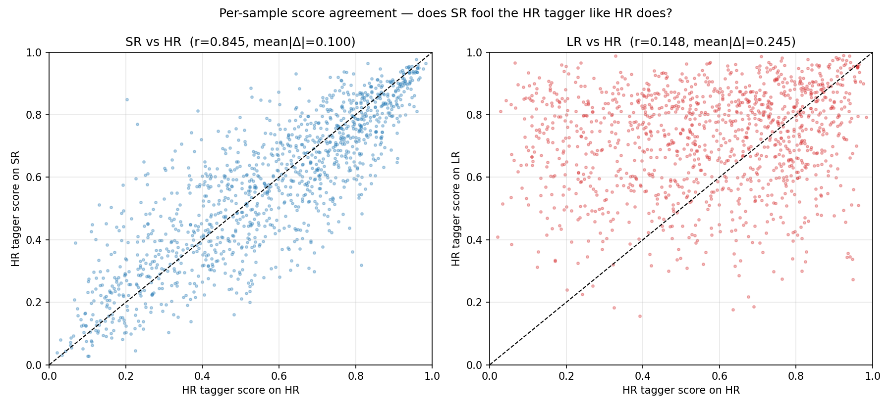

**32× — random scatter:**

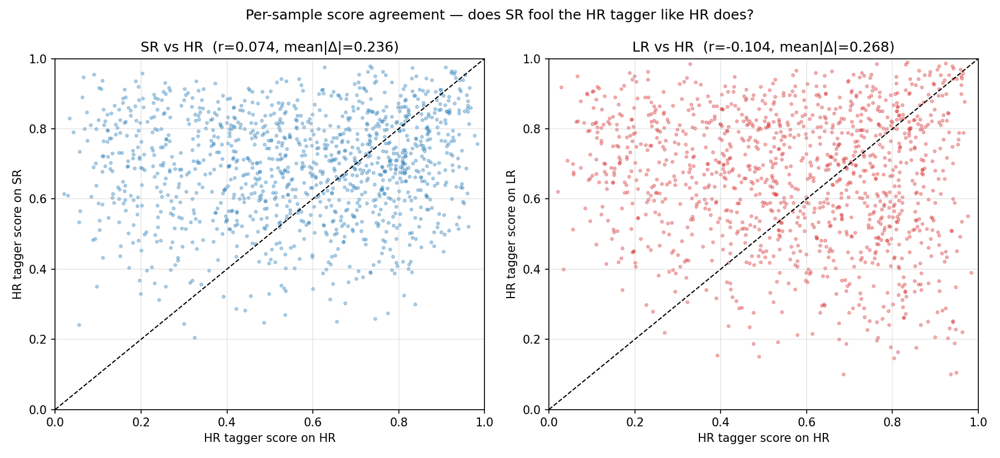

---

## 4. The two analyses (primary vs secondary)

The pipeline runs **two complementary analyses** so we can separate two distinct
questions:

1. **Primary — fixed HR-trained tagger** *(everything above).*
   One tagger trained on HR, then **frozen** and applied to HR/LR/SR.
   → *"Do SR images look like HR to a tagger trained on real data?"*
   This is the headline efficiency.

2. **Secondary — per-source taggers.**
   An **independent** tagger trained on each source.
   → *"How much class information does each source contain, regardless of
   HR-compatibility?"*

The secondary analysis reveals an important nuance:

| Scale | per-source AUC_SR | (vs fixed-HR AUC_SR) |
|------:|:-----------------:|:--------------------:|
| 16x | 0.731 | (0.539) |
| 32x | 0.743 | (0.518) |
| 64x | 0.707 | (0.698) |

At 16×/32×, SR images **are taggable on their own** (per-source AUC ≈ 0.73) — they
contain class structure. They just present it in a way that is **incompatible
with a tagger trained on real HR**. So the low-resolution failure is a
**distribution-mismatch** problem, not a total loss of information. This is an
actionable insight: it suggests that *training the downstream tagger on SR images*
(or domain-adapting it) could rescue 16×/32× performance.

---

## 5. How to reproduce

```bash
# Full diagnostic suite (all figures in §3) for one checkpoint:
python classification_eval.py \
    --checkpoint experiments/2026-06-23_datasets_64x_baseline/checkpoints/best.pt \
    --data-dir ../datasets

# Lightweight tagging-efficiency version (ROC + AUC bar only):
python tag_efficiency.py \
    --checkpoint experiments/2026-06-23_datasets_64x_baseline/checkpoints/best.pt \
    --data-dir ../datasets
```

Outputs land in `experiments/<run>/figures/classification/` (full suite) and
`experiments/<run>/figures/tagging/` (lightweight). Each writes a machine-readable
`*.json` and an `EXPLANATION.md`.

**Settings used for this report:** 4032 samples (2822 train / 1210 test, class
balance 2019/2013), tagger width 32, 15 epochs, seed 42. Parquet dataset only
(the HDF5/CaloChallenge data has no class label).

---

## 6. Summary for the mentor

- **New metric:** tagging efficiency (`AUC_SR / AUC_HR`) measures whether SR
  preserves the **physics-classification** information PSNR/SSIM ignore.
- **Clear, defensible result:** SR fully recovers HR taggability at **64×**
  (efficiency 100%, per-sample agreement r=0.85, calibration matches HR) but
  **fails at 16×/32×**, where SR output is no more HR-compatible than the bicubic
  baseline.
- **Nuance:** per-source taggers show 16×/32× SR still *contains* class
  information — the failure is HR-distribution mismatch, pointing to a concrete
  follow-up (train/adapt the tagger on SR).
- **Deliverables:** two reproducible pipelines (`classification_eval.py`,
  `tag_efficiency.py`), 7 figure types per model, JSON metrics, and this report.
```
